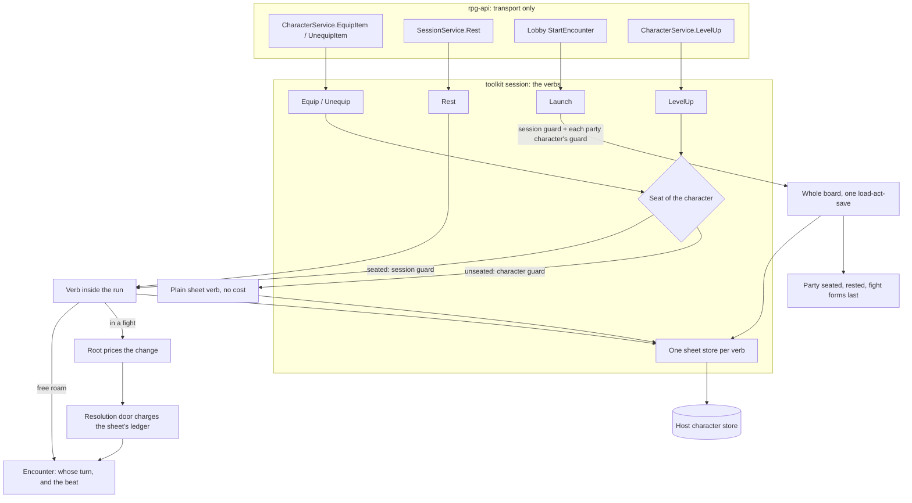

# Session verbs — equip, rest, launch on the SDK

## Shape

A character verb lives on the session Manager (R3). The **seat** — which run,
if any, holds a character — decides how the verb runs: an unseated character
gets a plain sheet verb under its own guard; a seated one gets the verb inside
its run, under the session's guard, priced on its turn when it is in a fight.
Every sheet a verb reads or writes goes through that verb's one store. Launch
builds the whole board, seats the party and lets the fight form once, in one
call.

## Law

### The seat

- A character is seated in at most one session. The seat is the session's
  fact: Launch and Join write it, Exit, End and the commit that closes a run
  clear it, and nothing else writes it.
- The seat is read by character id alone (rule S12): a session-owned record
  keyed by character, held through a host repository of its own (S13).
- A seat changes only under both the session's guard and the character's
  guard, session first, characters in id order. No verb holds a character's
  guard while waiting for a session's.
- A seated character's sheet is written only under its session's guard. An
  unseated character's sheet is written only under its own guard. A verb reads
  the seat under the guard it acts under, so the seat cannot move beneath it.
- A session started before seats exist protects nothing; pre-alpha runs are
  relaunched, never migrated.

### One sheet store per verb

- Every verb opens one sheet store under its guard. It is the only reader and
  the only writer of character records in that verb; no seam, builder or
  machine calls the host's character repository.
- The store reads the repository on every ask and writes through on every
  save. It holds no copy between asks (the sheet-facts law stands): the
  repository is the one copy, and the guard makes it the only writer.
- A member the roster names as a player and whose sheet is absent is one
  answer everywhere: the verb refuses with `ErrNoCharacter`. Exit, End and the
  reads still work, so a broken run can be left and closed.
- Every save records its aggregate on the verb's report; a failed save returns
  a `SaveError` naming what landed and what did not (S6). No call site builds
  a report by hand.
- The host's `SaveCharacter` stays a whole-record write. It is safe because the
  SDK is its only caller and every caller holds the right guard; rpg-api's
  separate equipment patch, version check and retry loop go away.

### Equip and unequip

- `Equip` and `Unequip` take a character, a slot and an item. They are the one
  equip path for every host surface; the rulebook's own equip rules (occupancy,
  two-handed weapons, swap on an occupied slot) run inside them unchanged.
- **Unseated:** a plain sheet verb. No cost, no story, no session touched.
- **Seated, free roam:** no cost (the economy is a fight's), under the session
  guard; the beat is told and sight is rechecked inside the verb, so watchers
  learn the new appearance without a second call.
- **Seated, in a fight:** a turn action. Off the member's turn it refuses with
  `ErrNotYourTurn`; a downed member refuses with `ErrDowned`. The price is the
  rulebook's, compiled from the change against the member's readied turn:
  - putting any held item away costs **the action** (R1);
  - drawing into an empty hand costs **the object interaction**; when this
    turn's interaction is spent, a draw costs the action instead;
  - a swap is both: the action for the stow, the interaction for the draw.
  An unpayable price refuses with `ErrCannotAfford` and writes nothing.
- The price is charged at resolution's door, as every turn price is; the
  session compiles nothing and pays nothing itself. The object interaction is a
  per-turn capacity on the sheet's ledger, refreshed with the turn.
- Rules as written, and the divergence: in 2014 the letter grants one free
  object interaction per turn for drawing *or* stowing, a second costs the Use
  an Object action, and dropping a held item is free. No drop exists for
  equipment, so stowing is billed as the action; drawing keeps the letter.
- The attack projection needs no refresh step: the encounter re-asks equipment
  and sheet facts at every consult, so the next consult reads the new hands.
- The response tells the actor what changed; the beat tells every member the
  encounter tells that member's acts. Nobody learns an equip from a response
  meant for someone else.

### Rest

- `Rest` takes a seated member, a kind and, for a short rest, how many hit dice
  to spend. A member in a fight is refused with `ErrInFight`.
- **Short rest** (letter): each hit die spent rolls the class hit die plus the
  Constitution modifier, at least zero per rest, capped at maximum hit points;
  every resource that resets on a short rest refills. The dice are thrown by the
  world's roller and each die names the resting character as its source.
- **Long rest** (letter): all hit points; half the hit dice back, at least one;
  every resource that resets on a short or long rest refills; death saves
  clear; the rest event ends what a rest ends.
- What resets is the resource's own reset kind on the sheet. No rest verb names
  a feature; Second Wind, Rage uses and spell slots refill because their
  resources say so.
- The first admission of a character to a run is a long rest, saved before the
  board is touched. It is one rule, applied by Launch and by Join alike, never
  repeated on a rejoin.
- A rest tells a beat naming the member, the kind and what it restored.

### Launch

- `Launch` takes the session id, the authored dungeon (compiled by the
  toolkit's dungeon compiler, keyed as the host registered it) and the party in
  seat order. The host mints the session id; party members are their character
  ids; monster member ids are minted by the compile from the author's ids. The
  host re-projects nothing.
- Launch is one load-act-save under the session guard and each party
  character's guard. It refuses before anything is written when the party
  outnumbers the seats, an id is claimed twice, or any sheet, monster or
  faction cannot be resolved.
- The whole board stands before anyone is seated, and no fight forms until the
  party is placed; the fight that forms then holds everyone it should. Two
  authored factions hostile to each other form their fight at the same moment,
  not partway through placement.
- Launch writes each party sheet (rested and seated), then the run, and returns
  one report naming every aggregate written or failed (S6).
- Launch builds the world with whatever capability value the session already
  installs; designing that value is not this design. After Launch, no host
  calls the compile-only constructors.

### rpg-api keeps transport

- rpg-api binds the caller to the character or member, calls the verb, maps
  its sentinels to codes, and projects armour class for its response from the
  record the verb saved. It holds no equipment rule, no rest rule, no dungeon
  re-projection and no appearance notifier.
- Protos change additively. Equip keeps its existing RPCs and messages; the
  session stream gains the equip and rest beats; `SessionService` gains
  `Rest`; the unimplemented legacy rest RPCs are marked deprecated.

## Rulings

| ID | status | scope | ruled by | date |
|---|---|---|---|---|
| R1 | settled | Swapping weapons costs the action: stowing a held weapon is the action, drawing into an empty hand is the free interaction; no drop exists. In a fight, equip is a turn action; outside one, a plain sheet verb with no cost | KirkDiggler | 2026-10-07 |
| R2 | settled | Remaining tier 2 order: this design (F), then D, E, A | KirkDiggler | 2026-10-08 |
| R3 | settled | Character verbs (level-up, equip, rest) live on the session SDK Manager; rpg-api keeps transport only | KirkDiggler | 2026-09-16 |
| R4 | open | The seat lives in a session-owned repository keyed by character (Open 1) | — | — |
| R5 | open | A rest inside a run is a short rest outside a fight, with no world time passing; the long rest is the first-admission rest only (Open 2) | — | — |
| R6 | open | A shield is not a weapon: donning or doffing it costs the action; body armour cannot change in a fight (Open 3) | — | — |
| R7 | open | Launch replaces StartSession and Spawn as host verbs; Join stays for a rejoin (Open 4) | — | — |
| R8 | open | Every seated equip tells a beat, a draw into an empty hand included (Open 5) | — | — |
| R9 | deferred-until-hands-are-one-model | Whether a held prop occupies a hand an equipped item needs (owner unset) | — | — |
| R10 | deferred-until-a-measured-cost | A verb-scoped sheet cache in the store; it stays write-through when it comes (owner unset) | — | — |
| R11 | deferred-until-authored-world-npcs | Launch places authored world NPCs; the temporary demo vendor stays a separate PlaceNPC call (owner unset) | — | — |
| R12 | deferred-until-a-use-case | An Afford row for equip, so a client can show a draw's price before asking (owner unset) | — | — |

## Open

1. **Where the seat lives.** Recommendation: a session-owned seat record keyed
   by character id, through its own host repository (S12, S13). The
   alternative is a field on the character record, which saves a port and a
   read but puts a session-written fact inside the rulebook's own record type.
2. **Rest inside a run.** Recommendation: a short rest is allowed in a run for
   a member not in a fight; no world time passes for it (divergence: the letter
   is an hour of light activity), and the long rest stays the first-admission
   rest, so the once-per-24-hours limit never needs a clock. Outside a run there
   is no rest verb: Launch already rests everyone.
3. **Shield and armour in a fight.** Recommendation: the letter — donning or
   doffing a shield is the action; body armour takes minutes, so an equip that
   changes it refuses in a fight.
4. **Launch versus StartSession.** Recommendation: Launch replaces
   StartSession and Spawn as host verbs (deprecated when Launch lands, deleted
   with the tier 3 deletions); Join stays for a member rejoining after Exit,
   and PlaceNPC for the demo vendor until R11.
5. **Does a draw into an empty hand tell a beat?** Recommendation: yes. A draw
   changes what every watcher sees, and the story is where a watcher learns it;
   only an unseated equip is silent.
