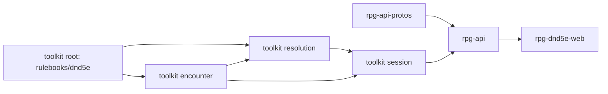

# Session verbs — slices

A working document beside `design.md`: the slice order and what done means per
module. It is not the implementation plan. The plan, with task contracts and
verification commands, follows design agreement under the design skill's
planning guide.

Develop outside-in, merge inside-out. One nearest-`go.mod` module per toolkit
PR; every consumer PR builds on its provider's branch pseudo-version until the
provider tags; the wave is walked once on the local stack before anything
merges. Protos express the contract and may merge before the walk so CI
publishes bindings.

## Order

The dungeon compiler (`encounter/dungeonspec`) sits inside the encounter
module, so the member-id minting it takes over rides the encounter slice.

## 1. toolkit root — `rulebooks/dnd5e`

Lands: the object interaction as a per-turn capacity on the ledger
(`combat.CapacityType`, the sheet's persisted economy, seeded by the turn
refresh); the equip price as a rulebook function compiling a spend profile from
an equipment change against a readied ledger (stow → the action; draw → the
interaction, or the action when it is spent); the shield and armour rule per
R6; the short rest as one character operation taking a hit-dice count and a
roller, replacing `SpendHitDice` and the dead `ShortRest`; `Data.ClassResources`
deleted (round-tripped, never read).

Done when:

- A readied turn holds one object interaction; a second turn's refresh restores
  it; a ledger that does not store it fails the capacity round-trip test.
- The price of drawing into an empty main hand is the interaction; of stowing
  a held longsword, the action; of a swap, both; of a draw after the
  interaction is spent, the action.
- A short rest spending two hit dice for a level-2 fighter with CON +2 heals
  two rolls plus 4, never below zero, never past maximum, and spends exactly two
  dice; refusing a count above what remains spends nothing.
- A short rest refills a short-rest resource (Second Wind) and leaves a
  long-rest one (Rage) alone; a long rest refills both and returns half the hit
  dice, at least one.
- No character record written by the module carries `class_resources`, and a
  record carrying it loads.

## 2. toolkit encounter

Lands: the equip and rest beats as exported kinds, recorded by verbs that
validate the member, refuse an equip off the member's turn in a fight and a
rest while the member is in a fight, and tell the beat to the audience the
encounter tells that member's acts; monster member-id minting moved into the
dungeon compiler, so a compiled dungeon carries every monster's member id.

Done when:

- Recording an equip for a member in a fight on another member's turn refuses
  with the not-your-turn sentinel and writes no beat.
- Recording a rest for a member in a fight refuses; in free roam it writes one
  beat naming the member and the kind.
- An equip beat reaches every member that perceives the actor and no member
  that does not.
- Compiling a dungeon with two unnamed goblins and one named placement yields
  three distinct member ids, the named one verbatim.

## 3. toolkit resolution

Lands: an equip entry the door charges before it applies the change to the
attached sheet, returning the dirty record (no cost passed means free roam,
charged nothing); a short-rest entry beside `LongRest`, rolling hit dice
through the roller it is given with each die naming the resting character.

Done when:

- An equip entry with the action already spent and a stow in the change
  refuses as unaffordable and returns no record.
- An equip entry with a cost pays exactly the compiled profile: one action for
  a stow, one interaction for a draw.
- A short-rest entry's trace carries every hit die with the character as its
  source; the returned record matches the root operation's result.

## 4. toolkit session

Lands: the seat (record, host repository, written by Launch and Join, cleared
by Exit, End and the closing commit); the character guard beside the session
guard, taken in the stated order; one sheet store per verb carrying every read
and every save, with the one missing-sheet answer and the report; `Equip`,
`Unequip`, `Rest` and `Launch`; `LevelUp` acting under the seat's guard with its
existing refusals; the first-admission rest shared by Launch and Join.

Done when:

- A verb that loads a seated sheet and an equip for the same character,
  issued together, both land: the equip is not overwritten.
- An unseated equip costs nothing and tells no beat; a seated free-roam equip
  costs nothing, tells one beat and rechecks sight; a seated in-fight equip off
  turn refuses with `ErrNotYourTurn`, and on turn with the action spent and a
  stow refuses with `ErrCannotAfford`, writing nothing in either case.
- A launch with two mutually hostile authored factions forms exactly one fight
  per contact after every member is placed; a launch whose third monster cannot
  be resolved writes nothing.
- A launch seats and rests every party member, and returns one report naming
  each character and the run.
- No file in the package except the store calls `GetCharacter` or
  `SaveCharacter`; the attack, move, boundary and standing paths answer a
  missing player sheet with `ErrNoCharacter`.
- A short rest inside a run spends the asked hit dice and tells a beat; asked
  in a fight it refuses.

## 5. rpg-api-protos

Lands: `SessionService.Rest` with its request (session, member, kind, hit dice)
and response; the equip and rest beats on the session event stream; the legacy
`EncounterService` rest RPCs marked `[deprecated = true]`. Equip RPCs and
messages are unchanged; their comments name the in-fight refusals.

Done when:

- `buf lint`, `buf format` and `buf breaking` pass and generation compiles.

## 6. rpg-api

Lands: equip and unequip handlers calling the SDK verbs and projecting armour
class from the record the verb saved; the equipment patch, its version check,
retry loop and appearance notifier deleted; the seat repository and the
character guard implemented; the lobby launch handing the compiled dungeon and
the party to `Launch`, with `sessionworld`'s re-projection and id checks
deleted (the demo vendor stays a `PlaceNPC` call, R11); the `Rest` handler.

Done when:

- No orchestrator in rpg-api calls an equipment rule, a rest rule or the
  compile-only constructors.
- Equip mid-fight off turn answers a failed-precondition code; on turn it
  answers the new armour class and every other player's stream carries the beat.
- A lobby start produces a run with every monster and party member placed and
  one fight formed.
- Walked: draw and stow in and out of a fight; a short rest between fights; a
  fresh launch.

## 7. rpg-dnd5e-web

Lands: the story renders the equip beat ("draws a longsword", "stows a
longsword") and the rest beat; the in-fight equip control shows the refusal;
a short-rest control in a run outside fights.

Done when:

- A watching player sees another's draw in the story and on the token without
  refetching.
- A refused in-fight equip shows its reason and leaves the hands unchanged.

## Rides along, not owned here

- `character.SpendHitDice` and `ShortRest` go with slice 1; `Data.ClassResources`
  likewise (tier 3, dead).
- The compile-only constructors lose their last host caller with slice 6;
  retiring them is tier 2 D's.
- `StartSession` and `Spawn` are deprecated as host verbs when R7 is settled;
  their deletion joins the tier 3 deletion PR.
