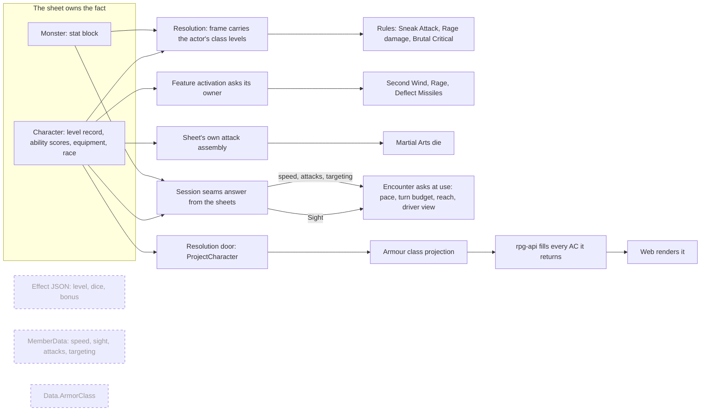

# Sheet facts asked at use time

## Shape

One owner per fact, many askers, no copies. The dashed boxes are the copies
this design retires. Each asker uses the channel its call shape already has: a
rule reads its frame, a feature is handed its owner, an override is called by
the sheet, encounter pulls through a capability. No new seam is invented to
carry a sheet fact.

## Law

### What a sheet fact is

- A sheet fact is a value the rules derive from a member's sheet: class levels,
  ability modifiers, speed, sight, the attacks the member can make, armour
  class. The sheet owns it. For levels the character's level record is the
  truth, and Load guarantees every character has one.
- A sheet fact is asked where it is used, at the moment it is used. Nothing
  below the sheet stores a copy, and no verb owns refreshing one, because a
  copy nobody refreshes is a wrong answer that looks like a right one.
- Authored content is not a copy. A monster's stat block armour class, speed,
  senses and targeting are the monster sheet's own values.
- A value a rule fixes at a moment is that moment's fact, not a copy. A ward's
  save DC recorded at cast stays recorded. Such a field is named and documented
  as the moment's value.

### Who holds each fact

| fact | held by | asked by | never copied into |
|---|---|---|---|
| class level | character level record | resolution (into the frame), a feature's owner question, the sheet's own assembly | condition or feature state, grant config, effect JSON |
| ability modifier | character ability scores | the cast member, a feature's owner | feature state, effect JSON |
| speed | character race; monster stat block | session, answering encounter's capability and its own push budget | encounter member and reserve records, the roster read |
| sight range | character sheet; monster stat block senses | session, answering the Sight capability | encounter member and reserve records, a session snapshot |
| attacks and their reach | character equipment, folded by resolution; monster stat block | session, answering encounter's capability | encounter member and reserve records |
| targeting | monster stat block, with the author's placement written onto it at spawn | session, answering encounter's capability | encounter member and reserve records |
| armour class | the fold behind the resolution door | rpg-api, for every response that carries it | the character blob, the rpg-api repository record |

### Who asks, and how

- A rule that answers from a frame reads the acting member's class levels from
  the frame. Resolution fills them from the actor's own sheet in both the
  information and the execution frame, because a member knows its own sheet. A
  monster actor's class levels are known and empty.
- A feature activated by its owner asks that owner at activation: class level
  through a named question the character answers from its level record, ability
  modifiers through the owner's ability scores.
- An override the sheet asks for during its own attack assembly is handed the
  sheet's level record by that call.
- Encounter asks for each member's speed, attacks and targeting through one
  capability, at the moment it paces a walk, budgets a turn, tests reach or
  builds a driver's view, exactly as it asks for equipment. Encounter persists
  none of them, in memory or in its blob.
- Sight is asked through the existing Sight capability. The session answers it
  from the member's sheet; the stated default range for a sheet that states
  none is the rulebook's answer, given by the sheet, never a session constant
  applied to a missing row.
- The session answers every encounter capability from the sheets the verb
  holds, refuses a member it holds no sheet for, and keeps no cache between
  consults. A session reading a member's speed for its own purpose asks the
  same sheet the capability answers from.
- Armour class is a projection folded through the resolution door. rpg-api
  fills every armour class it returns from that projection and stores none. A
  sheet the door cannot project fails the request that asked; no fallback
  number is sent.
- A cached armour class projection is the API's to add when a measured cost
  asks for one. A cache refreshes on every write of the sheet it describes,
  whichever layer writes it.

### Scaling and absence

- A class-scaled number is computed from the holder's level in that class, not
  the character's total level, so multiclassing needs no second rule.
- A holder of a class-scaled effect with zero levels in the scaling class is
  refused loudly: the effect cannot answer. Zero levels is never read as level
  one, and a factory never defaults a missing level.
- Advancing a level builds only what the new level grants. Everything already
  on the sheet reads the new level at its next use; nothing is rescaled.
- A copy carried by old saved data is ignored at load. The truth it copied is
  always present, so ignoring the copy loses no information and migrates
  nothing.

### Rules as written

- Every rule this touches follows the letter: Sneak Attack is one d6 per two
  rogue levels rounded up; Second Wind heals 1d10 plus fighter level; Rage
  damage scales with barbarian level and rages are unlimited at 20; Brutal
  Critical adds dice at barbarian 9, 13 and 17; the Martial Arts die scales with
  monk level; Deflect Missiles reduces by 1d10 plus Dexterity modifier plus monk
  level. No divergence is introduced.

### What stays out

- Advance gains no rescale step, and no effect gains a refresh hook.
- No proto changes. `CombatStats.armor_class` already means the character's
  armour class; its source changes and its contract does not.
- Monster stat block values stay on the monster sheet. Moving them is not this
  design.

## Rulings

| ID | status | scope | ruled by | date |
|---|---|---|---|---|
| R1 | settled | Retire `Data.ArmorClass`; armour class is only a projection; a list screen that needs it without a cast gets a projection the API caches, never a sheet field | KirkDiggler | 2026-10-07 |
| R2 | settled | Tier 2 order: this design (C) first, then B+G+H, F, A, E, D | KirkDiggler | 2026-10-07 |
| R3 | settled | A ward records its save DC at cast; that recorded DC is the cast's fact, not a sheet copy | KirkDiggler | 2026-10-07 |
| R4 | settled | Pre-alpha saved data: an old ward blob loads and is refused at use, never migrated silently (ward blobs only; its application to the copies here is O3) | KirkDiggler | 2026-10-07 |
| R5 | open | No effect stores a class level or a number derived from one; rules read the actor's class levels from the frame, features ask their owner, overrides are handed the record | — | — |
| R6 | open | Encounter persists no speed, sight, attacks or targeting; one capability answers speed, attacks and targeting; sight stays on the Sight capability answered from the sheet | — | — |
| R7 | open | rpg-api fills every armour class it returns from the projection; no cache in this design | — | — |
| R8 | deferred-until-a-speed-modifier-ships | How Unarmored Movement and any other modifier contributes to the speed answer (owner unset; meets open question 2 of the descriptor design) | — | — |
| R9 | deferred-until-a-measured-cost | A cached armour class projection for list screens (owner unset) | — | — |
| R10 | deferred-until-a-light-model | Sight beyond the stated default range (owner unset) | — | — |

## Open

- **O1 — a list with one unprojectable sheet.** ListCharacters fills armour
  class per character from the projection. Recommendation: one sheet the door
  refuses fails the whole list loudly, because pre-alpha a corrupt sheet is a
  defect to see, and `int32 armor_class` cannot say "absent" without a new
  field. The alternative is a per-row absence, which needs an additive proto
  field.
- **O2 — where the stated sight default lives.** The default range for a sheet
  that states none is a ruled number; this design moves the decision from a
  session constant onto the sheet (character and monster) so the seam can
  refuse a missing member instead of defaulting it. The number and the
  "silence means the same for both kinds" rule are unchanged; the location is
  the question.
- **O3 — old saved copies.** Effect JSON carrying a level, encounter blobs
  carrying member facts and character blobs carrying `armor_class` load, and
  the copy is ignored. Recommendation: confirm this as R4's treatment here; it
  is not a migration (the level record and the sheet always answer) and nothing
  is refused because nothing is missing.
