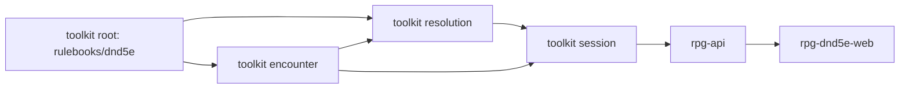

# Sheet facts at use time — slices

A working document beside `design.md`: the slice order and what done means per
module. It is not the implementation plan. The plan, with task contracts and
verification commands, follows design agreement under the design skill's
planning guide.

Develop outside-in, merge inside-out. One nearest-`go.mod` module per toolkit
PR; every consumer PR builds on its provider's branch pseudo-version until the
provider tags; the wave is walked once on the local stack before anything
merges.

## Order

No protos slice: `CombatStats.armor_class` keeps its meaning.

## 1. toolkit root — `rulebooks/dnd5e`

Lands: the frame fact for the actor's class levels and its validation; the
named class-level question the character answers from its level record; Sneak
Attack, Raging and Brutal Critical reading the frame; Rage, Second Wind and
Deflect Missiles asking their owner; Martial Arts handed the record by attack
assembly; Unarmored Movement's stored level deleted; every level, dice count,
damage bonus and stored Dexterity modifier gone from effect state, effect JSON,
factory configs and grant configs; `Data.ArmorClass`, the stored armour class
field, Finalize's Unarmored Defense special case and the stored-AC accessor
gone; armour class asked of every combat member through its fold.

Done when:

- A rogue advanced to level 3 rolls 2d6 Sneak Attack, and the information row
  for the same attack reads +2d6, from one rule function.
- A fighter advanced to level 2 heals 1d10 + 2 with Second Wind.
- A level-3 rogue sheet saved with a one-die Sneak Attack loads and rolls 2d6.
- A frame naming a Sneak Attack holder with zero rogue levels fails the fold
  with an error; no factory defaults a missing level.
- A frame with a malformed class-level fact (empty class, repeated class,
  levels below one) fails validation.
- No condition or feature JSON written by the module carries a level or a
  number derived from one.
- A finalized monk's blob carries no armour class, and its folded armour class
  under an installed cast is 10 + DEX + WIS.

## 2. toolkit encounter

Lands: one capability answering each member's speed, attacks and targeting,
consulted at pace, turn budget, reach and driver view with the same refusals
the Equipment capability makes (a stranger in the answer, a member missing
from it); the four fields leave the member record, the reserve record, the join
input and the exported member read.

Done when:

- A member whose capability answer changes speed between two walks paces the
  second walk at the new speed, with no write to the encounter.
- A driven member's turn budget and reach band read the capability's answer of
  that moment.
- An encounter blob written by the module carries no speed, sight, attacks or
  targeting, and a blob carrying them loads.
- A capability answer missing a member, or naming a stranger, aborts the verb.

## 3. toolkit resolution

Lands: the actor's class levels filled into the information frame from the
acting sheet and into the execution frame from the cast's sheets; the new
encounter capability carried through its input the way Sight and Equipment are.

Done when:

- An information frame and an execution frame for the same attack carry the
  same class levels for the actor.
- A monster actor's frame carries known, empty class levels.
- Inform and execution agree on Sneak Attack's benefit at rogue level 3.

## 4. toolkit session

Lands: the capability answered from the sheets each verb holds; the Sight seam
answered from each member's sheet with the rulebook's stated default (O2),
refusing a member it holds no sheet for; Join and Spawn stop copying the four
facts; the push budget reads speed from the same sheet answer.

Done when:

- A player walking outside a fight paces from the sheet's speed of that moment.
- A Sight consult for a member the verb holds no sheet for is refused, not
  answered with a default.
- A monster whose stat block authors darkvision sees that far; one that authors
  none sees the stated default.
- Join and Spawn place members with no copied speed, sight, attacks or
  targeting.

## 5. rpg-api

Lands: every armour class in a response — FinalizeDraft, GetCharacter,
ListCharacters, LevelUp, Equip, Unequip — filled from the resolution door's
projection; the repository's armour class write and field gone; a sheet the
door refuses fails its request (O1 decides the list).

Done when:

- GetCharacter for a monk returns the folded armour class including WIS.
- ListCharacters returns each character's folded armour class.
- No repository record written by rpg-api carries an armour class.
- Walked: the home screen and the character sheet show the folded armour class
  for a monk and a barbarian.

## 6. rpg-dnd5e-web

Lands: the character header and the selected-character panel stop inventing
armour class 10 for a missing value and render absence the way the combat stats
panel already does.

Done when:

- No component substitutes a number for a missing armour class.

## Rides along, not owned here

- The speed answer's unknown-race fallback is the tier 3 fail-silent item; it
  rides with the root slice only if that slice touches the speed accessor.
