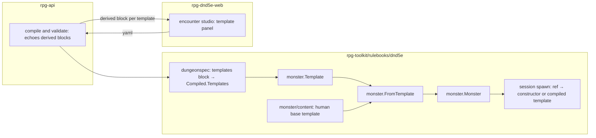

# Stat blocks as content — walkthrough

Issue: rpg-project#555 · Law: [design.md](design.md)

## What this is

A dungeon can declare named stat blocks and place them as monsters. The template is a
small authored record: a base, scores, hit dice, armor, skills, weapons. The rulebook turns it
into a monster through the same assembly a hand-written goblin uses, so everything after
assembly, including initiative, targeting, the stance graph, the answer table and the wire,
sees an ordinary monster. It introduces **no new member kind, no new placement verb and no
second place where a number is computed**.

## Component shape

## Ownership and contracts

| Component | Owns | Input → output |
|---|---|---|
| `monster.Template` | the authored record: `Base`, `Abilities`, `HitDice`, `Armor`, `Proficiency`, `Skills`, `Actions`, `Experience` | yaml mapping → typed template; refuses an unknown field, a bad die string, an unknown armor or weapon ref |
| `monster.FromTemplate` | the one derivation | template + base → `*Monster` with HP, AC, attacks and proficiencies set; refuses a missing base by name |
| rulebook content `human` | the base block as a template literal | none; assembled through `FromTemplate` like any other |
| `dungeonspec` | the `templates:` dialect, shape checks only | yaml → `Compiled.Templates map[id]TemplateSpec` of authored strings; refuses a malformed ref, die string or score, and a template deriving from a template |
| `session` spawn | choosing the source of a monster ref | ref → rulebook constructor, or the compiled template; both is refused as shadowing, neither is refused as unknown |
| rpg-api compile and validate | authoring-time resolution and the derived echo | yaml → existing compile result plus one derived block per template; shadowing and unknown refs as field errors |
| encounter studio | editing the template record | form edits → yaml; shows the echoed derived block |

Refusals, one per boundary:

- `FromTemplate` does not accept an authored hit point or armor class total.
- `dungeonspec` does not derive anything and does not resolve a ref; it carries the template
  and checks shape.
- `session` does not merge a template over a constructor; a ref has exactly one source.
- rpg-api does not compute a modifier, a bonus or a total; it forwards the toolkit's echo.
- The studio does not compute a derived number, even for a live preview; an unanswered
  field shows as unanswered.

## Walk one thing through

The author writes `guard` with `con: 12`, `hitDice: 2d8` and `armor: chain-shirt`.

1. The studio writes the yaml above. No number is derived; `con: 12` is the only
   constitution fact that exists.
2. rpg-api hands the yaml to `dungeonspec`, which produces `Compiled.Templates["guard"]`
   with `Base: dnd5e:monsters:human` and the three stated fields as strings. rpg-api then
   checks `dnd5e:monsters:guard` against the rulebook registry and finds no constructor, so
   the template is the ref's one source.
3. `FromTemplate` loads `human`, merges per field (strength 10 from the base, constitution 12
   from the override), reads `2d8` as two dice averaging 4.5 each, adds the +1 constitution
   modifier per die, and stores 11 hit points. Chain shirt's rule gives 13 plus a dexterity
   modifier capped at 2, so AC is 13 at dexterity 10. `spear` is assembled through
   `AddWeapon` from strength 10 and proficiency 2 into +2 to hit, 1d6.
4. The compile echo carries `{ hp: 11, ac: 13, attacks: [spear +2 1d6], passive perception: 12 }`
   back to the studio. The author sees the consequence of `con: 12` without the studio
   knowing what a constitution modifier is.
5. At spawn, `session` finds no constructor for `guard`, finds the compiled template, calls
   `FromTemplate`, and places the member as `KindMonster` in faction `watch`. The faction's
   `stance: neutral, until: {fact: alarm-raised}` governs it from here. Nothing downstream
   reads the template again.

## Separations that look like one thing

| Query | Source of truth |
|---|---|
| What did the author state? | the template record |
| What are the creature's live numbers? | the assembled monster, derived once |
| Who is this creature hostile to? | the faction stance graph, never the template |
| What does this creature do with its turn? | the answer table on its binding, never the template |

Storing a derived total on the template makes an override to the score it came from a lie:
the author raises constitution and nothing changes. Putting disposition or orders on the
template conflates who a creature is with whose side it is on; two guards share a block and
can stand on opposite sides of a truce.

## Trade-offs

| Decision | Benefit | Cost / boundary | Not taken |
|---|---|---|---|
| Template is a monster ref (R2) | zero changes to placement, targeting, stance, wire | the author's id namespace shares the rulebook's; shadowing refused | a new `dnd5e:templates:*` ref type |
| Derive, never store totals (R3) | an override always takes | hit points are the average; the author cannot type `hp: 11` | authored totals with a derived fallback |
| Base plus per-field merge (R4) | one-line overrides | a second merge grammar beside the table's wholesale rule, written down | reuse the table's layer law |
| One base block, `human` (R5) | the smallest content that proves the shape | every castle NPC descends from `human` until a second base is needed | base per race from the DMG tables |
| Echoed derivation (R7) | the client never computes | a studio preview is a round trip | a shared derivation library in TypeScript |
| Per-dungeon templates (R10) | no registry, no cross-dungeon versioning | a template is retyped per dungeon until reuse is wanted | a content registry on day one |

Who pays: the compiler pays the shadowing check; the author pays the round trip and the
average hit points; the toolkit pays the one assembly function.

## Edges

- No spawn-time rolling: two guards from one template have identical hit points (Open).
- No per-placement score override (R9).
- No multiattack spelling on a template (Open).
- No cross-dungeon reuse (R10).
- No change to KindWorld, Interact or Trade (R1, R11).
- No allied flip (R12).

## Where a change lands

- **A blacksmith stronger than the template**: a per-field override on the placement
  binding, merged by R4's rule, assembled by the same `FromTemplate`. Touches `dungeonspec`
  and the binding; nothing else.
- **A second base, `dwarf`**: one more template literal in rulebook content. Nothing else.
- **Hit dice rolled at spawn**: `FromTemplate` takes a roller; the compile echo shows a range
  instead of a total; the studio shows the range. Touches the monster package, the echo and
  the panel, which is the finding that the preview seam is the one place variance shows.

## Source map

| Concern | Path |
|---|---|
| template record and assembly | `rpg-toolkit/rulebooks/dnd5e/monster` (`Template`, `FromTemplate`, `AddWeapon`, `Config`) |
| base block content | `rpg-toolkit/rulebooks/dnd5e/monster/monsters` (beside `registry.go`) |
| armor class rule | `rpg-toolkit/rulebooks/dnd5e/armor` (`MaxDexBonus`) |
| yaml dialect and compile | `rpg-toolkit/rulebooks/dnd5e/encounter/dungeonspec` (`single_room.go`, `compile.go`, `Compiled`) |
| spawn source selection | `rpg-toolkit/rulebooks/dnd5e/session` (`entities.go` `arm`, spawn path) |
| derived echo on the wire | `rpg-api-protos` dungeon validate/compile response; `rpg-api` dungeon orchestrator |
| template panel | `rpg-dnd5e-web/src/concepts/encounter-studio` |
