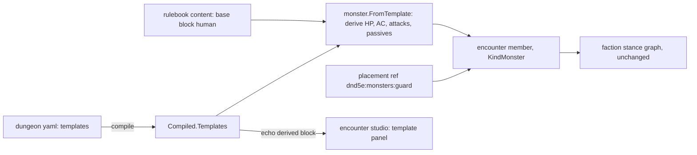

# Stat blocks as content

A creature's numbers are authored data, derived once by the rulebook, and spread across
placements by reference. The kitchen worker, the guard and the guard captain in the mad
king's castle are monsters: they fight, flip stance, and die by the machinery every monster
already has. The only new thing is where their numbers come from.

## Shape



A **template** is a named block in the dungeon yaml: a base, scores, hit dice, armor,
proficient skills and weapons. The compiler carries it; the rulebook derives the live numbers
from it in one place; a placement names it like any monster ref. Nothing after assembly learns
that a template existed.

```yaml
templates:
  guard:
    base: dnd5e:monsters:human
    abilities: { str: 13, con: 12, wis: 11 }
    hitDice: 2d8
    armor: dnd5e:armor:chain-shirt
    skills: [perception]
    actions: [dnd5e:weapons:spear]
  captain:
    base: dnd5e:monsters:human
    abilities: { str: 15, dex: 14, con: 14, cha: 14 }
    hitDice: 10d8
    armor: dnd5e:armor:breastplate
    proficiency: 3
    actions: [dnd5e:weapons:longsword, dnd5e:weapons:javelin]
  cook:
    base: dnd5e:monsters:human
    actions: [dnd5e:weapons:dagger]

monsterDeclarations:
  - { id: guard-1, ref: "dnd5e:monsters:guard", startingCell: { q: 4, r: 5 } }
  - { id: guard-2, ref: "dnd5e:monsters:guard", startingCell: { q: 6, r: 5 } }
  - { id: cook-1,  ref: "dnd5e:monsters:cook",  startingCell: { q: 9, r: 2 } }
```

## Law

- **R1 — A combatant NPC is a monster.** A creature that can be attacked or can turn hostile
  is placed as `dnd5e:monsters:*`. Templates add no member kind, no placement verb and no
  targeting rule; the stance graph, aggression law and `until` predicates apply unchanged.
- **R2 — A template is a monster ref.** A declared template is referenced as
  `dnd5e:monsters:<id>` and routes through the monster placement path. A template id that
  names an existing rulebook monster is refused wherever the ref is resolved, at authoring
  and at launch, so an author never shadows the rulebook silently. The compiler checks the
  template's shape only; it never knows what a ref resolves to.
- **R3 — Stored is authored, live is derived.** A template stores ability scores, hit dice,
  armor, proficiency bonus, proficient skills, weapons and experience. Hit points, armor
  class, attack bonus, damage and passive perception are derived by the rulebook at assembly
  and are never authored on the template, because a stored total silently stops following the
  score it came from.
- **R4 — Base plus override.** A template names a base block; every unstated field is the
  base's. Overrides merge per field. A template is not a table layer and does not obey the
  table's nearest-key-wins-wholesale rule.
- **R5 — The rulebook ships the base.** `dnd5e:monsters:human` is rulebook content: scores of
  10, `1d8` hit dice, no armor, unarmed strike, proficiency 2, experience 0. It is itself a
  template, so a base is assembled by the same function as a derived block.
- **R6 — One assembly.** `monster.FromTemplate` is the only function that turns a template
  into a monster. Weapons derive from the creature's scores and proficiency through the
  existing `AddWeapon` path; armor class derives through the armor catalogue's own rule;
  hit points are the hit dice average plus the constitution modifier per die.
- **R7 — Derivation lives in the toolkit.** The studio and the API never compute a derived
  number. The compile answer echoes each template's derived block, and the studio shows what
  it is told.
- **R8 — Zero values tell the truth.** An unstated score is the base's; an unstated weapon
  list is the base's; experience absent is worth nothing; a template with no base is refused
  by name. Absence never means zero hit points or zero armor class.
- **R9 — Placement overrides stay where they are.** `actions:` on a placement binding
  replaces the template's weapons wholesale, exactly as it replaces a rulebook monster's
  today. No other per-placement stat override exists in this slice.

## Rulings

| ID | status | scope | ruled by | date |
|---|---|---|---|---|
| R1 | settled | combatant NPCs are monster-kind; KindWorld untouched | KirkDiggler | 2026-10-10 |
| R2 | settled | template referenced as a monster ref; shadowing refused | KirkDiggler | 2026-10-10 |
| R3 | settled | author scores and dice, derive totals; author-time not spawn-time | KirkDiggler | 2026-10-10 |
| R4 | settled | base plus per-field override; not a table layer | KirkDiggler | 2026-10-10 |
| R5 | settled | one rulebook base `human` | KirkDiggler | 2026-10-10 |
| R6 | settled | one assembly in the monster package | KirkDiggler | 2026-10-10 |
| R7 | settled | derived numbers echoed by compile, never computed by a client | KirkDiggler | 2026-10-10 |
| R8 | settled | absence inherits or refuses; never zero | KirkDiggler | 2026-10-10 |
| R9 | settled | only `actions:` overrides per placement in this slice | KirkDiggler | 2026-10-10 |
| R10 | deferred-until-a-second-dungeon-reuses-a-template | templates shared across dungeons through a content registry | KirkDiggler | 2026-10-10 |
| R11 | deferred-until-the-trade-use-case | trading as an offer on a monster binding; vendor capability off the npc record | KirkDiggler | 2026-10-10 |
| R12 | deferred-until-the-guards-turn-coat | `allied` on `until`; a monster joining the party's side | KirkDiggler | 2026-10-10 |

## Open

- **Hit dice rolled at spawn.** R3 fixes hit points at the average. A later option rolls the
  dice through the shared dice with the creature as the entity, the way temperament is dealt
  from a mix. Open until a use case wants two guards with different hit points.
- **Per-placement score overrides.** One blacksmith stronger than the template. R9 keeps it
  out; the merge rule of R4 would apply unchanged on the binding when it arrives.
- **Existing Go constructors as templates.** The thirteen rulebook monsters stay constructors.
  Whether they become templates is a cleanup decided when the second base block is needed.
- **Multiattack on a template.** The captain's two attacks per turn is a sequence arm the
  rulebook already has for constructors; its yaml spelling on a template is not in this slice.
- **KindWorld's future.** Nothing here removes it. Whether the home town keeps untargetable
  world members is decided when the home town is authored.
