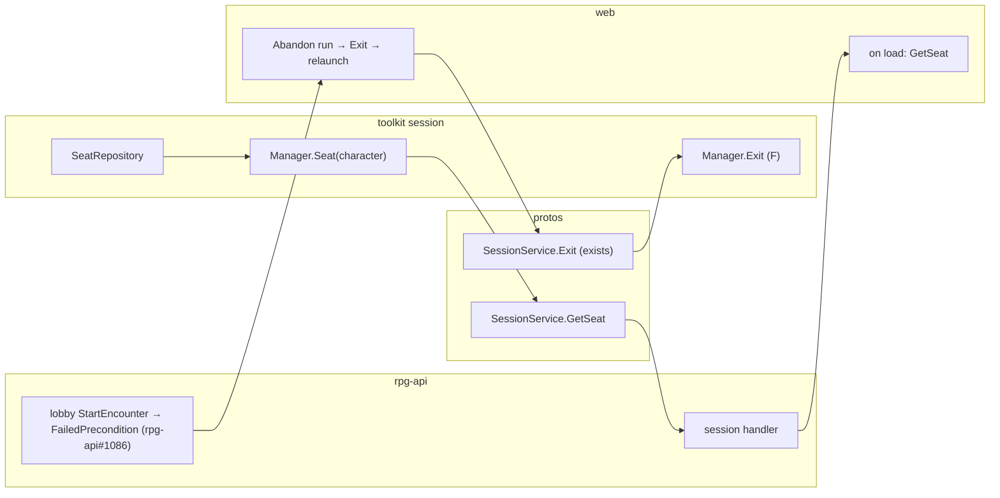

# The seat is visible — abandon a run you can no longer see

Tracking: [rpg-project#548](https://github.com/KirkDiggler/rpg-project/issues/548).
Slices: [slices.md](slices.md).

## Shape

A character seated in a run can always learn which run, and can always leave it,
even when the lobby that launched it is gone or belongs to someone else. The
seat already exists (F) and `Exit` already frees it; this wave makes the seat
readable and gives the player the verb from outside the run.

## Law

- **The seat is a fact the character can read.** `session.Manager.Seat(ctx, character)`
  answers the stored `SeatData` or `ErrNoSeat`. It reads; it never creates,
  moves or clears a seat.
- **One way out, already written.** Leaving a run from the lobby is `Exit` on
  that run for that member. No second verb, no "force unseat", no lobby-side
  deletion of a seat. `Exit` settles held effects exactly as it does from inside
  the run.
- **The lobby refuses, the client offers.** A launch refused because a party
  character is seated elsewhere is `FailedPrecondition` naming the character and
  the run (rpg-api#1086). The client reads the seat with `GetSeat`, offers
  "Abandon run", calls `Exit`, and retries the launch. The server never exits a
  character on the client's behalf during launch.
- **Additive wire.** `SessionService.GetSeat` is new; `Exit` is unchanged; no
  lobby message changes.

## Rulings

| ID | status | scope | ruled by | date |
|---|---|---|---|---|
| R1 | settled | A player must be able to leave a run from outside it ("abandon run"); Back in the lobby is where the web team places it | KirkDiggler | 2026-10-09 |
| R2 | settled | The seat is read through the session SDK and the session service, not inferred from the lobby | KirkDiggler (platform ruling) | 2026-10-09 |

## Open

None. The shapes are those already in the engine; this wave exposes them.
