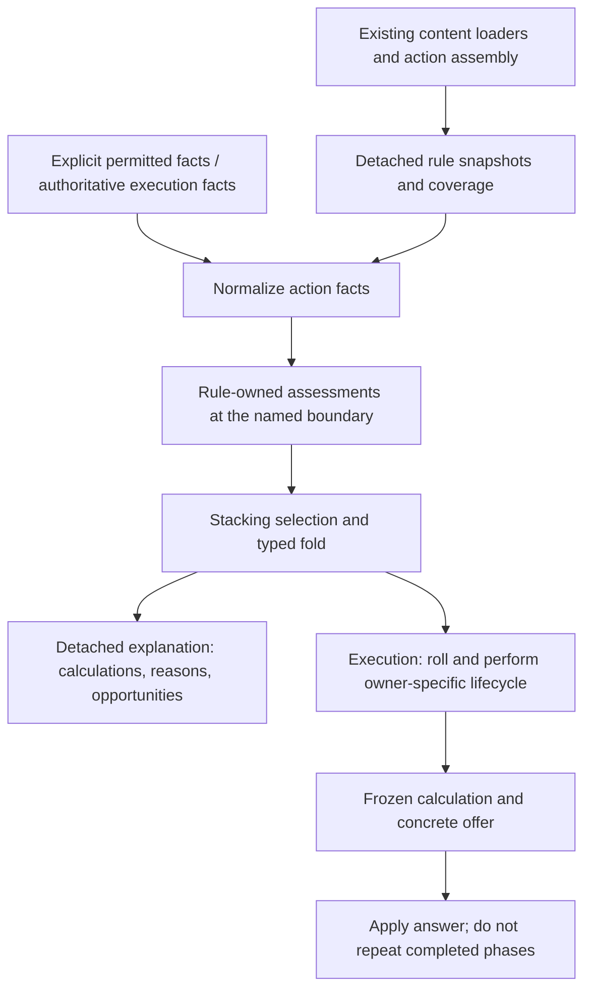

# Shared assessments — concrete contract proposal

Status: proposed R3/R4 interfaces, not implemented APIs or an implementation
handoff. R12 settles unsupported-assessment behavior; R13 settles the permitted-
knowledge visibility boundary, not its exact projection interface. R14 settles
the initial calculation scope as explanation of effects, not outcome prediction.
This document
refines the interfaces in [toolkit-contract.md](toolkit-contract.md) §§3–7;
that document retains the package dependency picture and worked examples.
The [coverage inventory](contribution-coverage.md) identifies current producers,
execution boundaries and migration proofs. Neither document declares new game
eligibility rules. In particular, toolkit#1929 is not repaired by this component.

## Shape



Explanation and execution use the same rule functions and fold operations, with
potentially different knowledge and at different times. Execution does not accept
a previously returned explanation as authority. There is no dry-run interaction,
preview bus, predicate interpreter, or session-side list of spell behaviors.

## 1. Contracts by owner

Names below are concrete design notation. They are not declarations already
available to import; supporting types and validation must be implemented together.

| Owner | Input → output | Responsibility / exclusions |
|---|---|---|
| `combat/weaponattack`, `character`, `spells` | Existing equipment/casting facts → action definition plus assembly evidence | Emit original sourced ability, proficiency, base pools and any applied override evidence where derived. No reverse-engineering an aggregate bonus. |
| `contributions` | Value constructors / validators → detached source, amount, term, fact and selection values | Inert shared vocabulary below events/actions; no content registry, bus, character or condition import. |
| `conditions`, `features`, `monstertraits` | Their already-decoded state → detached operation capabilities and coverage | One predicate implementation per rule; no independent display registry or duplicate JSON decoder. |
| `combat/assessment` | Typed operation frame + rule decision → new local evaluation state | Pure validation, replacement, selection and folding tools. No content-identity switch, rolling, spending or effect removal. |
| `resolution` | Data records, actual action variant, bounded context and question → explanation | Loads and assembles, constructs frames, sequences the shared tools. It also drives the same assessments at execution boundaries. |
| `encounter` and rulebook fact projections | Declared participants and observation inputs → bounded spatial/participant facts | Answer factual questions, not whether Sneak Attack or another particular rule applies. |
| `session` | Authorized IDs, records and context → detached public mirror | Carries inputs and projects answers; cannot decide missing-context defaults or individual rule eligibility. |

Base rules count as producers too. Visibility modifiers, base ability/proficiency,
off-hand damage policy, spell DC and healing assembly are not optional merely
because no condition implements them. Keep their current rule owner or extract a
shared pure function there; the explanation calls it rather than copies it.

## 2. Rule binding, identity and coverage

A rule capability is made from a detached snapshot, not a live condition receiver
that still holds a bus, participant pointer or roller. Loaded state remains the
canonical state; the snapshot is per-evaluation working data, not another persisted
model. Constructors deep-copy refs, slices and maps. Reads never call `Apply`.

Proposed binding envelope:

```text
RuleBinding
  ID                 evaluation-local instance identity
  Source             existing source vocabulary, relocated once
  ConditionAddress?  existing address when this really is a condition
  Order              deterministic participant/provider order
  Coverage[]         named operation + facets + supported/not-relevant/unsupported
  Normalizer?        operation-specific capability
  Attack?            operation-specific capability
  Damage?            operation-specific capability
```

Features and inherent rules need not invent a condition address. The binding ID
identifies two instances of the same content within this evaluation; it is not a
new durable effect identity, selector or authorization token. Public output
contains detached source evidence, never capability objects. Frozen execution
stores the data needed by the existing continuation, not these Go interfaces.

Coverage is declared at the owning registration/assembly site and checked before
evaluation. The inventory universe includes condition loaders, feature loaders,
monster-trait loaders and inherent producers. A non-implementing optional
interface cannot mean “not relevant.” Registry enumeration and fixture tests must
catch newly loadable providers that lack a declaration. Migration updates each
existing registry, not a second ref-to-explanation table in resolution.

Coverage is operation- and facet-specific. Rage can support outgoing damage while
its defensive behavior is outside a question explicitly scoped before defenses.
A read scoped before defenses does not claim the defense calculation is complete.
An unsupported attack-keep provider affects the attack roll and any damage
eligibility that depends on its keep result; it need not invalidate an unrelated
healing calculation. Unknown impact invalidates all requested mechanical facets,
not an arbitrarily guessed subset. Description access remains separate.

## 3. Explicit facts and operation inputs

`Fact[T]` has exactly two valid states: Known(value), including false/zero/empty,
and Unknown with no retained meaningful value. Invalid facts are errors, not
Unknown. Missing target selection is distinct from a selected target whose
particular facts are unavailable. An empty observed participant list does not
prove that no relevant participant exists.

The concrete attack/damage frames need these inputs:

| Frame field | Value / producer |
|---|---|
| `ActorID`, action variant | Existing owned-item/slot/grip or cast variant identity, resolved by the owning assembler; no ref-only equipment guess |
| `Action` | Detached typed definition and source-bearing assembly evidence |
| `Ability` and `Pools` | Effective normalized ability evidence and exact pool IDs; base and replacement sources retained |
| `Actor` | Operation-relevant ability/equipment facts; each rule snapshot carries its own usage state rather than a duplicated generic condition map |
| `Target` | Selection state and, when selected, its ID; no mutable target sheet |
| `Spatial` | Known/unknown distances and directional sight facts for named pairs, supplied by encounter |
| `Participants` | Declared fact universe: ordered IDs with permitted hostility, life-state and resource facts needed by participating rules; explicit completeness for the question |
| `Keep` | Granted/imposed source lists and their cancellation result, or pending when an earlier provider is unresolved |
| `Scenario` | Named calculation branch: attack roll, normal-hit damage before defenses, critical-hit damage before defenses; a hypothetical branch is not an observed hit |
| `Established` | Only choices/outcomes already reached by execution; an advance read contains no rolled faces, target AC or unpublished result |

Spatial and participant records are typed facts, not callbacks that can query
arbitrary world state. In particular, a rule receives distances and relationships,
not a caller-computed `SneakAttackAllowed` boolean. Exact exported projection
fields and the member-observation adapter remain R4 design work; these are the
facts the measured providers require, not permission to expose full sheets.

Normalization, attack-roll assessment and damage assessment have different input
types. A normalizer cannot read a rolled face. A damage assessor receives the
normalized pools and established or explicitly hypothetical hit/critical branch.
Save and healing consumers retain their own narrow contracts; Bless/Bane's
roll-kind decision and the existing healing declaration remain shared rather
than copied into an attack-shaped object.

## 4. Assessment outputs

Proposed operation interfaces in `combat/assessment`:

```go
// Design notation; the named frame/decision types are specified here, not Go APIs.
type NormalizeAttackInput struct { Frame NormalizationFrame }
type NormalizeAttackOutput struct { Decision NormalizationDecision }
type AttackNormalizer interface {
    NormalizeAttack(*NormalizeAttackInput) (*NormalizeAttackOutput, error)
}

type AssessAttackInput struct { Frame AttackFrame }
type AssessAttackOutput struct { Decision AttackDecision }
type AttackRule interface {
    AssessAttack(*AssessAttackInput) (*AssessAttackOutput, error)
}

type AssessDamageInput struct { Frame DamageFrame }
type AssessDamageOutput struct { Decision DamageDecision }
type DamageRule interface {
    AssessDamage(*AssessDamageInput) (*AssessDamageOutput, error)
}
```

Every decision has exactly one applicability arm:

| Arm | Required data | What it may not do |
|---|---|---|
| `Applies` | Source, rule-authored reason and nonempty typed changes and/or opportunities | Empty success, unsupported callbacks, or spending instructions executed by the reader |
| `DoesNotApply` | Source and rule-authored reason | Add a mechanical term; turn a missing required fact into a definite negative |
| `NeedsContext` | Source, nonempty typed needs, affected facets and rule-authored explanation | Insert pending dice into a settled formula |

`Need` names a factual input, such as target identity, pair distance, directional
sight or a bounded neighborhood; it is not an executable rule expression. Rules
may short-circuit on decisive known facts: spent usage can settle ineligibility
without first asking for a target. New input can refine the same rule assessment.

**Stacking selection is separate.** A provider can apply and be suppressed.
Preserve the selected/suppressed source and reason, using the owning policy.
For the existing oldest-applicable groups, retain persisted order within the
recipient. Unknown eligibility of an earlier candidate prevents claiming a later
candidate certainly wins. Do not generalize every modifier to oldest-wins:
Divine Favor's existing selection behavior and advantage cancellation need their
own faithfully extracted decisions.

Typed changes are bounded by phase:

- Normalization: replace an ability term or exact pool dice, mark a pool property;
  retain displaced evidence. Never accumulate old and new replacements as bonuses.
- Attack: add fixed/dice terms, grant/impose keep sources, set critical threshold,
  describe a later choice opportunity.
- Damage: add a sourced fixed/dice term with pool identity, damage type and critical
  treatment; describe the supported GWF face-reroll policy on the exact weapon pool.

A critical-only contribution belongs to that named branch. An opportunity carries
source, timing and typed potential benefit, not an executable offer or a guaranteed
bonus. Post-roll face operations remain execution work; no expected-value damage
bonus is invented for a reroll policy.

Unsupported evaluation is **not a fourth rule-eligibility answer**. Coverage
reports a missing capability; a failing/contradictory assessor reports an error.
The explanation layer must not fabricate “does not apply” on either path.

## 5. Composition and calculation availability

The primary consumer is an effect indication with a canonical tooltip, not a
calculation dashboard. The proposed public effect record carries source identity,
name, canonical description, assessment availability, applicability when known,
contextual reason/need, and contribution-versus-opportunity participation. Preserve
stacking selection separately; a suppressed applicable source is not an ineligible
one. These are detached presentation facts, not a rule evaluator or command token.

Canonical description and contextual reason have different jobs: what the effect
is versus why it can/cannot apply here. A name-only entry is not sufficient tooltip
content. Reuse and fill the owning content projection rather than introducing an
API/web description table. The [consumer trace](effect-info-delivery.md) gives the
concrete source paths, scenarios and remaining target-inspection decision.

The calculation structures below support the shared assessment/execution machinery
and any explicitly requested mechanical detail. Rendering them as a standalone
panel is not a prerequisite or substitute for effect/tooltip acceptance.

At each relevant execution/read boundary:

1. Validate input identity, declared scope, detached facts and coverage.
2. Assemble original terms once. Keep Shillelagh's already-applied override as
   evidence or move its application into normalization; never apply it twice.
3. Apply ordered normalizers to evaluation-local state before any dependent
   contribution. Later normalizers see prior changes. Preserve deterministic
   order within normalization; do not invent a dependency solver. Stack selection
   also applies to normalization providers; a suppressed provider performs no edit.
4. Build attack terms and keep policies from the effective facts; apply selection
   and cancellation, preserving sources. Damage assessment consumes that result.
5. Evaluate each named damage branch against those facts. Dependencies on pending
   normalization/keep inputs remain pending, not computed using stale base facts.
6. Produce per-facet calculation availability and detached assessments.

The concrete migration must test paired normalizers and the attack/damage ability
agreement. R9 authorizes explicit normalization, not an unreviewed new winner rule
for competing replacements. Any such uncovered gameplay decision remains with
the rule owner and operator, never with a tooltip-specific implementation.

Proposed output for every requested calculation:

```text
Calculation
  Facet, Scope, Assumptions
  Availability: Complete | PendingContext | Unavailable
  Terms and sources
  Expression?        provider-formatted; present only as a settled scoped formula
  Needs[]            required for PendingContext
  UnavailableReason? required for Unavailable
```

A complete actor-side normal-hit formula is not a prediction of HP loss. Pending
results may expose known individual terms, but not a complete-looking expression
when an unresolved replacement or contribution can change it. A separately named,
complete subtotal must explicitly state its narrower scope.

R12: unsupported evaluation removes the affected settled calculation, not the
action's content description or execution permission. An unsupported damage
provider need not hide a complete attack formula. Invalid identity/malformed
request data remains a read error; no fake description is returned for an unknown
action. Unexpected evaluator failures must never result in a successful partial
formula; diagnostics and exact error mapping remain an implementation contract.

The UI renders the supplied applicability/reason: active, gray/ineligible, or
conditional. It neither recognizes individual effects nor computes eligibility
from their names, positions or prose. Ineligible information is not a command
refusal; the existing legality provider still decides whether the action runs.

## 6. Execution custody

No generic `ConsumeContribution` callback is part of an assessment. Execution
adapters use the shared decision and keep the owning rule's current lifecycle
boundary. An informational read cannot publish an event, sustain Rage, advance a
clock, decrement a resource, remove a condition, or request a die.

| Boundary | Execution owns | Read owns |
|---|---|---|
| Before attack roll | Current authoritative assessment; existing Help/Hidden/True Strike/Mockery consumption and Protection spend at their declared execution points | Terms/policies and reasons only |
| After an actual attack roll | Guiding Bolt consumption; actual offer collection; Rage tracking at its existing post-attack boundary | Advance opportunity, or already-frozen values if inspecting a pose |
| After answer to a pose | Validate frozen offer, roll only accepted benefit, notify its owner, continue | No newly minted offer token and no recomputation of frozen totals |
| Damage boundary | Assess damage against established facts; roll selected pools; apply GWF to real faces; Sneak Attack's usage transition | Named hypothetical branch, unresolved dice and automatic policy |
| Target application / later events | Defenses, HP, concentration and reaction transitions | No claim of final target outcome from a before-defenses calculation |

Re-evaluate at the start of an action and when a genuinely later boundary needs
new facts; do not reevaluate a completed frozen stage. Freeze established
normalization evidence with the action when later damage depends on it, rather
than deriving a different attack ability or weapon pool after resume. Retained
source evidence must survive removal of the contributing one-use effect. Multiple informational
opportunities do not change the currently supported number or sequencing of
concrete offers.

Historical execution callers that remain live must use the same extracted rule
decision or be retired. An unchanged second predicate in a legacy handler is not
completion of the extraction.

## 7. Context boundary and remaining decisions

Settled visibility boundary, R13: informational assessment uses only the
character's permitted knowledge; execution uses authoritative state. The proposed
R4 mechanism supplies that knowledge as a bounded fact projection. Do not enumerate hidden opponent effects and redact labels afterward:
changed totals, pending rows and error shape all leak information. Generic scope
statements about omitted target context must not depend on whether a hidden effect
actually exists. A known qualifying neighbor can establish a positive existential
predicate; a negative requires the relevant complete facts, as decided by the rule.

No selected-target UI is required just to establish this fit. The exact
member-visible projection fields, observation sources and access interface remain
open; the current encounter's observations are not automatically a complete model
of target effects, resources or what the target can see.

Before implementation handoffs:

1. Settle the member-visible fact projection and current-action read inputs (R4,
   remaining R5), including target inspection and equipment/action variant identity.
   Current target clicks execute immediately; decide the pre-commit inspection
   interaction identified in the consumer trace before prescribing UI changes.
2. Confirm the concrete assessment/capability shape above (R3), including how
   loader-owned snapshots and per-facet coverage are exposed without bus attachment.
3. Derive coverage and acceptance for R14's settled scope: attack contributions,
   normal/critical damage before defenses, spell DC/potential healing, conditional
   effects and opportunities, refined by permitted selected-target facts. AC,
   final target damage, movement and later reaction outcomes are inventoried,
   not promised predictions. Do not build a simulator to supply this explanation.
4. Derive exact provider/consumer interfaces, files and test tasks using the design
   skill's planning guide. No interface here is claimed compiled or verified yet.
