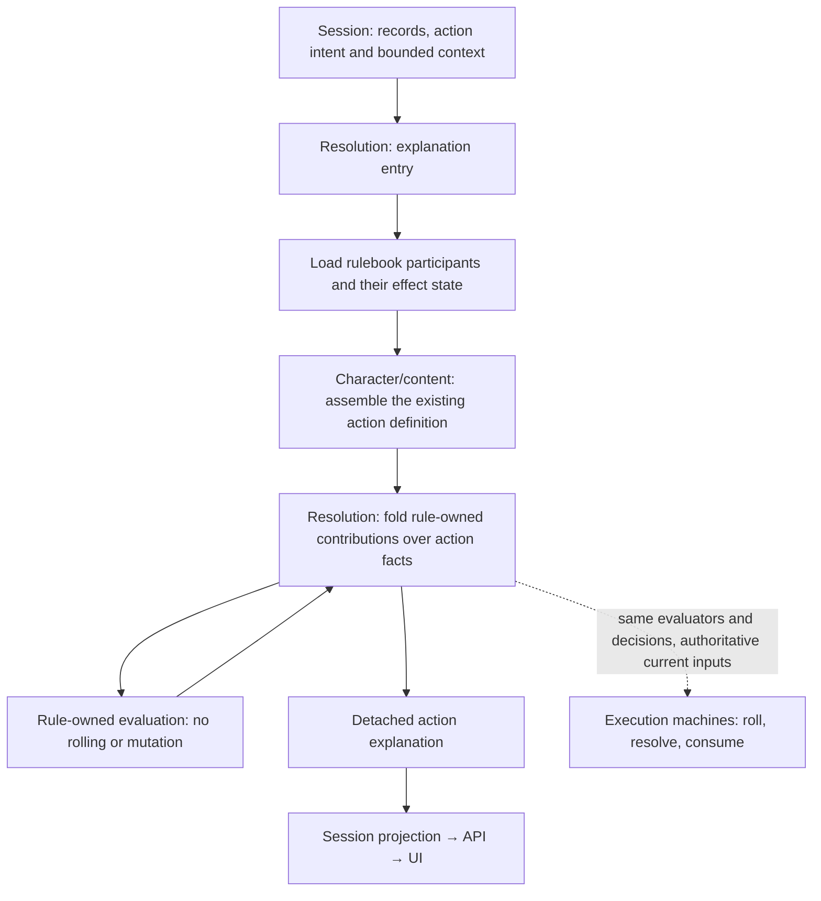

# Contribution contract — worked design sketch

Proposal for R3–R5, not an approved interface or an implementation. Names and
YAML below describe values; they are not new Go types, a proto schema, an
executable rules language, or a format the client interprets. The settled
ownership is R7 in [design.md](design.md).

## The component in its layers



This is information flow, not imports. No runtime character or condition leaves
resolution in the returned explanation. Session supplies records and context;
resolution can load and assemble the corresponding runtime participants itself.

Three distinct things need contracts:

1. **Evaluation context:** the facts available to a rule at a particular point.
2. **Rule assessment:** what the rule contributes, whether it applies, and which
   facts or choices are still missing.
3. **Action explanation:** resolution's composed answer, retaining provenance and
   unresolved alternatives rather than pretending to know a final outcome.

`actions.Definition`, `AttackProfile` and `CastProfile` remain the action model.
A contribution contract does not become a replacement spell schema or encode
all spell behavior into generic modifier records.

## 1. Evaluation context

For an attack-shaped operation, the useful inputs are:

| Input | Owner | Meaning |
|---|---|---|
| Action definition and evidence | character/content | Category, delivery, weapon, grip, ability, damage pools, cost |
| Actor facts and current rule instances | character/conditions | Abilities, equipment, active effects, turn-scoped usage |
| Target and spatial/observation facts, when supplied | encounter and rulebook participants | The declared universe and the facts this evaluation may use |
| Known choices and outcomes at this point | resolution | Selected option, actual roll/hit/critical only when established |

A condition's own persisted state belongs to that condition instance. Resolution
loads it; the caller does not manufacture a second Rage or Bless state object.

Missing target, missing outcome and an unknown spatial relation are not false,
zero, or empty lists. They remain unavailable facts. Evaluation does not look up
arbitrary missing facts from storage or silently access ambient whole-world truth.
The exact typed representation of partial facts remains to be chosen.

Explanation and execution share rule evaluators, not necessarily identical
knowledge. Execution has authoritative context; a member-facing explanation
must use permitted knowledge and cannot query hidden truth then leak its answer
through totals, applicability flags, sources, or omissions. The visibility
projection is an explicit R4 contract still to define.

## 2. Rule assessment

Each rule can return:

- **Applicable:** its contribution is established for the supplied context.
- **Not applicable:** the relevant facts are known and its predicate fails.
- **Needs context:** applicability cannot yet be established; name the missing
  input category and provide a player-facing explanation where permitted.

Those answers are independent of two other distinctions:

- **Which part of the action:** attack roll, damage on a hit, healing, etc.
- **When a choice is available:** a possible after-roll expenditure is not a die
  already added to an attack roll.

Do not flatten all of these into one overloaded status enum. Rage can be
applicable to **damage on a hit** even though a hit has not happened. Inspiration
can be an applicable **opportunity to choose** without being a committed bonus.

Each assessment retains the rule source and, where relevant, the effect's
source-qualified identity. Existing `events.RollSource` and condition-address
vocabulary are precedents to reuse, not identities to re-invent.

### Illustrative interface boundary

Prefer operation-specific contracts over a single bag of every possible game
fact. For the attack case, the shape to test is:

```go
// Design pseudocode; supporting types and package names are not final.
type AssessAttackInput struct {
    Facts AttackFacts // Read-only facts at this point in the staged fold.
}

type AssessAttackOutput struct {
    Assessment AttackAssessment
}

type AttackContributor interface {
    AssessAttack(*AssessAttackInput) (*AssessAttackOutput, error)
}

type AttackAssessment struct {
    Source        Source
    Applicability Applicability // Applicable, NotApplicable, NeedsContext.
    Changes       []AttackChange
    Opportunities []AttackOpportunity
    Needs         []AttackFactNeed
    Explanation   string // Rule-authored; not an executable predicate.
}
```

This interface is internal to the rulebook. A loaded condition can implement it;
neither that condition nor the interface crosses the session boundary. Providers
read their own state and supplied facts, returning inert values. Input carries no
roller, repository, mutable participant, event publisher, or session manager.

Stage/stacking metadata must remain available to the owning fold, following the
existing provider-owned selection precedent. Their exact interface is still
open: the sample signature does not imply that all providers run once in an
arbitrary order. A save or healing operation gets its own typed fact contract
when its current consumer needs one, sharing the source and term vocabulary.

`AttackChange` is a typed operation, not an arbitrary callback or JSON blob.
Resolution applies supported operations to its own evaluation state; the rule's
predicate remains with the contributor. Contradictory outputs such as Applicable
with missing required facts are rejected, not coerced into a partial success.

### Contribution payloads

Use typed payloads for operations the game actually supports. The initial shapes
to test against current content are:

| Payload family | Existing example | What it preserves |
|---|---|---|
| Add a fixed term | Rage, Archery, Dueling | Amount, calculation affected, source, damage pool/type where relevant |
| Add an unresolved dice term | Bless, Bane, Divine Favor | Dice, add/subtract operator, source, calculation/pool |
| Modify an attack roll's keep rule | advantage/disadvantage effects | Grant/impose and source; cancellation preserves both sources |
| Replace an action fact or pool | Shillelagh, Martial Arts | The exact subject changed, replacement and source |
| Offer a choice | Bardic Inspiration | Existing offer semantics, timing, source and consequence if chosen |
| Describe an outcome-dependent rule | Great Weapon Fighting, critical riders | Reroll/critical semantics without invented rolled values |

These are candidate families, not a mandated new universal union. Reuse existing
weapon overrides, offers, damage pools and dice vocabulary where their meaning
matches. New payload kinds earn their place through a current rule that cannot
be represented faithfully. New spells using existing kinds should need no
identity-specific session, API or UI branch.

Rules own predicates and authored explanations in code/content. Missing-context
requirements are typed fact needs, not snippets of a generic boolean expression
language evaluated by session or web.

## 3. Worked example: a blessed, raging axe attack

Illustrative fixture: a proficient character has Strength +3, proficiency +2,
a greataxe, a current Rage with damage bonus +2, and Bless from another character.
Assume no other modifiers. No particular target is selected.

### Input assembled below session

```yaml
actor: barbarian-a
action:
  ref: dnd5e:weapons:greataxe
  category: weapon
  delivery: { melee_reach_ft: 5 }
  ability: { name: strength, modifier: 3 }
  attack_bonus: 5
  primary_damage: { dice: 1d12, type: slashing }
effects:
  - { rule: raging, recipient: barbarian-a, damage_bonus: 2 }
  - { rule: blessed, recipient: barbarian-a, source: cleric-b }
target: not_selected
```

The abbreviated effect values illustrate persisted facts, not a public format or
an instruction for session to inspect condition fields. Existing action damage
properties still decide where an ability modifier belongs; this snippet omits
them for readability.

### Decisions the rules return

```yaml
- source: Strength
  applies: true
  contribution: { to: attack_roll, fixed: 3 }
- source: Proficiency
  applies: true
  contribution: { to: attack_roll, fixed: 2 }
- source: Bless
  source_entity: cleric-b
  applies: true
  contribution: { to: attack_roll, dice: 1d4, operator: add }
- source: Greataxe
  applies: true
  contribution: { to: damage_on_hit, dice: 1d12, type: slashing }
- source: Strength
  applies: true
  contribution: { to: damage_on_hit, fixed: 3, type: slashing }
- source: Rage
  applies: true
  contribution: { to: damage_on_hit, fixed: 2, type: slashing }
```

Character assembly must preserve Strength/proficiency provenance where it derives
the bonus. Today `AttackProfile.AttackBonus` is a scalar. The explanation must
not infer a proficiency contribution by subtracting an ability modifier from an
opaque total. The richer assembly evidence is work, not a claim about the current
contract. The base damage rule also owns off-hand omissions and similar cases;
this example is not a new rule that every attack adds its ability modifier.

### Resolution's composed result

```yaml
attack_roll:
  expression: "1d20 + 5 + 1d4"
  sources: [Strength, Proficiency, Bless]
damage_on_normal_hit:
  pools:
    - { expression: "1d12 + 5", type: slashing }
  sources: [Greataxe, Strength, Rage]
context:
  target: not_selected
  target_dependent_modifiers: unresolved
```

The expression is formatted from the selected terms in the toolkit, not parsed
or summed by web. Source-bearing terms remain alongside the display expression.
The result says **normal hit before target defenses**, not final HP loss, and
does not claim a complete target-specific attack bonus or advantage state.

Changing the action to a ranged Dexterity attack lets Rage itself return
`not applicable: requires an eligible melee Strength attack`. Bless can still
contribute. Resolution does not contain an axe/bow/Rage switch.

## 4. Missing target and optional choices

A rogue's Sneak Attack cannot be represented as unconditional extra damage just
because the effect exists. With relevant target context absent, an assessment
can say that eligibility needs more context. When that context is supplied,
resolution asks the same rule again and gets the applicable or inapplicable
answer. There is no second 'tooltip Sneak Attack' predicate.

Already-spent turn state can rule a contribution out without needing a target.
A pending target is not an excuse to omit known usage state.

Bardic Inspiration is different:

```yaml
source: Bardic Inspiration
source_entity: bard-c
kind: choice_opportunity
when: after_attack_roll_before_outcome
option: { dice: 1d6, action: add_to_attack_roll }
consumed: only_when_taken
```

This describes an opportunity, not an executable offer token minted early. It
must not appear in the committed `attack_roll.expression`. At the real post-roll
boundary execution creates the actual offer and, if accepted, rolls and consumes
it through the existing lifecycle. Hovering never causes `OfferTaken`.

Proposed presentation distinguishes two reads:

- **Before acting:** note that the character holds an applicable after-roll
  opportunity, with its source, die and timing. This is neither a reservation nor
  the actual question, and it does not join the committed attack expression.
- **At the pause:** describe the concrete offer against the frozen calculation.
  The player sees the roll/current total and can spend or keep the die, without
  learning the target's AC or an unpublished success/failure result.

The pause is after the attack roll, not after damage and final outcome. Reading
that pause uses its frozen facts. Resume preserves the existing d20 and all
already-rolled contributions; spending rolls only the offered die. Keeping it
leaves it unspent. It does not re-run the original attack fold.

This matches the existing pause/resume custody in `resolution/strike_pose.go:257`
and `:304`, and the visibility boundary in `session/types.go:2260`. The pre-action
informational projection is proposed new work. The current strike pose refuses
more than one offer (`strike_pose.go:262`); a list in an information contract does
not by itself implement multiple simultaneous choices. That future composition
case must retain explicit sequencing and freeze semantics, not be mistaken for
already-supported behavior.

## 5. Composition is a staged fold, not a sum

Resolution cannot ask every rule against the initial input, concatenate all
answers, and add them up. Some rules transform facts another rule reads.

Conceptually:

```text
assembled action + available facts
  → rule-owned transformations at their defined stage
  → later rules read the transformed facts
  → stacking / selection / cancellation
  → sourced unresolved terms and alternatives
```

Preserve the established semantics of `combat.ModifierStages` and the ordering
inside each stage. Do not casually reorder replacements ahead of additions if
that changes today's execution behavior. The current Martial Arts and Rage
handlers illustrate why the final ability matters; extracting a pure path must
be checked against their actual fold and tests.

If an unresolved transformation affects an input needed by a later rule, the
later assessment is unresolved too—not computed from the unmodified base value
as though the transformation could not happen. Whether the initial contract
supports explicit alternatives or returns pending assessments is an open detail.

Dice faces are never available in a pre-roll explanation. A reroll rule is
reported as a rule and is evaluated against real faces only at its execution
boundary. A pre-action explanation need not materialize every possible outcome.

## 6. The same data is used, but the old read is not executed

Explanation returns detached data. It rolls nothing, spends nothing, emits no
interaction events, advances no clock, and consumes no effect.

Starting execution re-evaluates against current authoritative state rather than
trusting an earlier informational read. At the relevant machine boundaries it
uses the same contribution selectors/folds, resolves the chosen dice, and
performs the existing lifecycle transitions. State or a player's choice may
change after an explanation; the old response is never an authority token for
its terms.

Resuming a paused execution is different: its frozen calculation and offer are
the authority for the stopped stage. Resume applies the answer and continues;
it does not re-evaluate or reroll the already-settled part from a fresh sheet.
Any facts newly needed by later stages follow their existing lifecycle rather
than reopening completed stages.

This does not require one giant up-front execution plan. Attack-roll decisions,
post-roll opportunities, on-hit damage, and reaction decisions occur at their
own boundaries. Shared evaluation is used at each boundary; explanation retains
what is known and names what remains conditional.

An optional descriptive interface that silently skips all other effects cannot
establish completeness. The migration needs an explicit inventory and coverage
check for current action-affecting rules, plus read-versus-execution tests. Rules
without an explanatory capability must not silently disappear from an answer
advertised as complete. Exact unsupported-data behavior remains to be ruled.

## 7. Spells and creation still fit

Creation reads authored catalog information without constructing a fake actor,
setting a save DC of zero, or attaching a pretend effect collection. A spell
requiring a save can explain its save ability without claiming a character DC.

In play a spell-attack profile can use the same attack-roll contributions as a
weapon attack: Bless affects the attack roll, while a weapon-only damage rule
refuses a spell attack. Save-based casts and healing retain their existing typed
profiles rather than masquerading as attacks. Their explanation adds the
character's actual save DC or sourced healing modifiers through their own rules.
A caster's Bless does not increase their spell-save DC.

Descriptions of non-numeric consequences remain content/condition-owned. Generic
resolution must not decode opaque condition parameters to invent prose about
what each spell does. Covering duration, restrictions and consequence descriptions
requires its own small, explicit content information projection, not a second
mechanical implementation.

## Source anchors behind this proposal

At toolkit `b784cf79`:

- `combat/actions/definition.go:20`: existing typed definition envelope.
- `combat/actions/attack.go:31`: profile, ability evidence and explicit off-hand
  semantics; scalar attack bonus is not a full provenance record.
- `events/roll_trace.go:47`: existing unresolved roll contribution contract.
- `conditions/blessed.go:151`, `conditions/baned.go:190`: provider-owned
  applicability and group selection.
- `rolls/resolve.go:21,49`: selected terms are validated, rolled once and retained
  as sourced physical components. This is a working separation to build on.
- `conditions/shillelagh.go:84`: a pure typed weapon override already exists.
- `conditions/inspired.go:215,248`: offering is distinct from taking/consuming.
- `combat/stages.go:18`, `conditions/martial_arts.go:200`,
  `conditions/raging.go:413`: transformations, rolls and eligibility are mixed in
  current folds; migration must preserve semantics without running them on reads.

No runtime tests or code implementation accompany this sketch. Examples describe
the proposed contract, not the current API's output.
