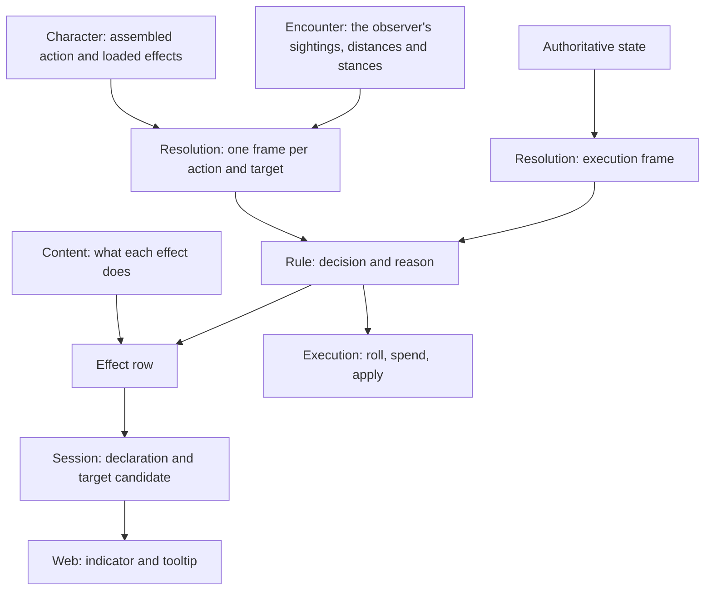

# Effect information

## Shape

This is a what-applies system. A player looking at an action sees which effects
bear on it, whether each one applies, and what each one does. The same rule
function answers for the tooltip and for the swing; only the facts it is handed
differ. The arrows show information flow, not Go imports.

## Law

### What the player sees

- Each effect bearing on an action is shown in one of three states: it applies,
  it does not apply with the rule's reason, or it depends on something not yet
  known. An effect that does not apply stays visible and readable.
- Each effect carries a description of what it does, separate from the reason
  it does or does not apply here.
- Nothing predicts a roll, a hit chance, a total or damage dealt. No simulated
  dice and no calculation panel.
- A benefit the player chooses later, such as Bardic Inspiration, is shown as
  available, never as already added.
- Hover or keyboard focus shows the rows; clicking acts exactly as it does
  without them; touch has a read-only way to see the same rows.

### Who owns what

- A description is content, authored once beside the rule it describes. Session,
  API and web hold no second description table.
- A rule answers one question: given this frame, does it apply, and why. It
  returns the decision, the reason and what it contributes as data.
- A rule answering that question reads nothing but the frame. It does not query
  the world, roll, spend, publish or change state.
- Execution and information call the same rule function, and a rule keeps no
  second predicate, because a tooltip that disagrees with the swing is worse
  than no tooltip.
- Resolution builds the frame, once per action and target. No rule assembles its
  own facts.
- A frame holds typed facts, each known or unknown. Unknown is never read as
  false, and a known false, zero or empty value stays known.
- At execution a rule that answers that it depends fails the action with an
  error. It is never treated as not applying, because a frame missing a fact
  would otherwise switch a rule off silently.
- The action's effective ability and dice are settled before any rule that
  depends on them is asked. Handler registration order does not define that.
- A relationship between two members is their stance on the disposition graph
  at the moment of asking: hostile, neutral or allied. It is not a boolean and
  it is not cached, because dispositions change during an encounter.
- Toolkit owns rules and their answers. API transports them. Web renders them
  and recognises no effect by name.

### What the character may know

- An information frame holds what the acting character knows: its own sheet, its
  current sightings, the distances between them and the stances it believes.
- An execution frame holds authoritative state. An earlier information answer is
  never accepted as authority to act.
- Hidden state cannot change an information answer. Identical permitted facts
  give identical rows.
- The information frame draws from the observer's sightings only, never from
  the target sheets offer compilation loads for its own purposes.
- An empty or partial set of sightings does not prove that no qualifying
  creature exists. A rule needing that proof answers that it depends.

### How it reaches the player

- Effect rows ride the declarations the client already receives. Rows that do
  not depend on a target sit on the declaration; answers that do sit on each
  target candidate.
- There is no separate inspection request, no second action identity and no
  separate freshness, because a declaration already identifies its action and
  is refreshed when state changes.
- Availability and applicability are independent. An unavailable declaration
  still carries its rows, and no row grants or refuses an action.
- A declaration that carries no action content carries no rows. Rows are not
  delivered outside the member's own turn or during a frozen window.
- A row carries the effect's source reference and name, its description, its
  state, the rule's reason, whether it contributes now or is a later choice, and
  an optional rule-authored line stating the benefit.
- An effect whose rule cannot yet answer is shown as unavailable. It is never
  dropped and never shown as not applying.
- The wire names no class feature and no action variant.

### What stays out

- Information does not fold. It lists each rule's answer and produces no
  totals, expressions or completeness claims.
- Execution keeps each rule's own lifecycle: when it rolls, when it is spent
  and when it is consumed. Reading information moves none of those.
- A paused action keeps its frozen calculation. Current rows describe current
  actions and are never joined into a frozen roll as its history.
- Catalogue descriptions for choosing a weapon or spell come from the same
  content owner and are delivered on their own. They need no character and no
  frame.

## Rulings

| ID | status | scope | ruled by | date |
|---|---|---|---|---|
| R1 | settled | Show which effects apply and what they do; no outcome prediction, totals or calculation panel | KirkDiggler | 2026-10-05 |
| R2 | settled | Rules return decision, reason and contribution as data; resolution builds the frame; one rule function serves execution and information | KirkDiggler | 2026-10-05 |
| R3 | settled | Information does not fold | KirkDiggler | 2026-10-05 |
| R4 | settled | Rows ride declarations and target candidates; no separate read, action identity or variant enum | KirkDiggler | 2026-10-05 |
| R5 | settled | Relationships are the disposition-graph stance at the moment of asking | KirkDiggler | 2026-10-05 |
| R6 | settled | Information uses the character's permitted knowledge; unknown stays unresolved; execution uses authoritative state | KirkDiggler | 2026-10-03 |
| R7 | settled | Three visible states; an unanswerable rule is unavailable, not negative; availability and applicability are independent | KirkDiggler | 2026-10-03 |
| R8 | settled | Hover or focus inspects, click acts unchanged, touch has a read-only path | KirkDiggler | 2026-10-03 |
| R9 | settled | Later-choice benefits are shown as available, not added; reading changes nothing; a resumed action keeps its frozen calculation | KirkDiggler | 2026-10-02 |
| R10 | settled | Effective ability and dice are settled before dependent rules are asked | KirkDiggler | 2026-10-02 |
| R11 | settled | Descriptions are content beside the rule; catalogue information is delivered separately | KirkDiggler | 2026-10-02 |
| R12 | deferred-until-a-use-case | Rows outside the member's own turn or during a frozen window | KirkDiggler | 2026-10-05 |
| R13 | settled | At execution a rule that cannot answer fails the action loudly; never a silent non-application | KirkDiggler | 2026-10-05 |
| R14 | deferred-until-a-use-case | Resolution assembling execution's contributions in place of each handler adding its own | KirkDiggler | 2026-10-05 |

## Open

None.
