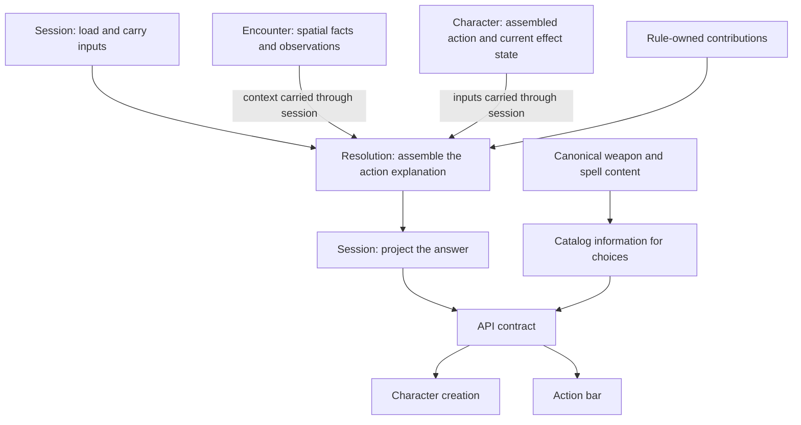

# Weapon and spell information

## Shape

The two views answer different questions: what a weapon or spell does, and what
this character can do with it now. They share rulebook authority, not necessarily
an identical payload. Session is the carrier; resolution assembles the current
action's explanation using rule-owned contributions and supplied context. The
arrows show information flow, not Go imports. The contribution contract and exact
wire contract remain open.

## Law

- Character choices expose information about the weapon or spell being chosen.
- Permitted catalogue alternatives remain inspectable after choosing, including
  weapons or spells the player did not select. Inspection changes no selection,
  ownership, equipment, spell access or execution permission.
- Information access is independent of current action affordability. Existing
  offers and refusals remain authoritative for costs and whether an action can
  be performed; the information component does not duplicate those decisions.
- In-play information describes the character's current action, including active
  effects that change it; base character numbers alone are insufficient.
- Rage, Bless and other applicable effects are required in the current-action
  scope. The catalogue increment does not claim to deliver that live explanation.
- Toolkit owns rules and their derived facts. API transports them; web renders
  them and sends intent without reconstructing game rules.
- Session loads and carries inputs and projects answers; it does not calculate
  modifier eligibility or combine game arithmetic.
- Resolution assembles current-action information from supplied action, character,
  effect and encounter context using rule-owned contributions.
- Each contributing rule owns its applicability and contribution. Resolution owns
  their composition; encounter owns spatial facts and observations.
- Action-fact normalization is explicit: settle the applicable die and ability
  before evaluating contributions that depend on them. Handler registration
  order does not implicitly define that dependency.
- A contribution already participates in a calculation; an opportunity describes
  a possible later choice; a posed offer is a concrete question on a frozen
  interaction. They are distinct data, not interchangeable modifiers.
- Bardic Inspiration is noted before acting as an after-roll opportunity, not
  included in the committed attack formula or spent by an informational read.
- The Inspiration question occurs after the attack roll and before revealing its
  outcome. The question exposes the current calculation, not the target's AC or
  unpublished success/failure result.
- Starting an action evaluates current authoritative state. Resuming a paused
  action preserves the frozen calculation and applies the answer without
  re-evaluating or rerolling completed stages.
- Accepting an Inspiration offer rolls its die and consumes the benefit;
  declining preserves it. Inspecting either view changes nothing.
- The effort supplies information to character creation and play before an action
  is committed. Existing combat-log traces are its consistency reference, not a
  new presentation feature. It does not depend on a general UI redesign.
- Component boundaries and extensibility govern the design before delivery
  slices. Future target-aware information tests the shape without automatically
  requiring its UI in the first delivery.
- Catalogue and current-action information share canonical content ownership and
  references. Their connection is designed together; catalogue information ships
  as an independently useful first increment, followed by current-action work.
- Catalogue reads require no dummy character, invented modifiers or resolution
  interaction. Later action explanations reuse the content authority instead of
  creating a second description/mechanics catalogue.

## Rulings

| ID | status | scope | ruled by | date |
|---|---|---|---|---|
| R1 | settled | Catalog facts for choosing; character-specific facts for using; both surfaces in scope | KirkDiggler | 2026-10-02 |
| R2 | settled | Current-action information includes active effects such as Rage and Bless, not only base numbers | KirkDiggler | 2026-10-02 |
| R3 | open | Shared contribution mechanism, ownership and side-effect-free read contract | — | — |
| R4 | open | Target-dependent and unresolved information; observer-visible limits | — | — |
| R5 | open | Information payload, catalog coverage and end-to-end acceptance | — | — |
| R6 | settled | Prioritize component shape, composition and future fit over selecting immediate UI slices | KirkDiggler | 2026-10-02 |
| R7 | settled | Session carries inputs and answers; resolution assembles supplied context using rule-owned contributions | KirkDiggler | 2026-10-02 |
| R8 | settled | Contributions, advance opportunities and frozen offers are distinct; Inspiration is noted before acting and asked at its post-roll pause; resume preserves settled facts | KirkDiggler | 2026-10-02 |
| R9 | settled | Explicit normalization of action facts before evaluating dependent contributions | KirkDiggler | 2026-10-02 |
| R10 | settled | Information remains inspectable independently of affordability and after selection, including unchosen alternatives; existing affordability UI/authority remains unchanged | KirkDiggler | 2026-10-02 |
| R11 | settled | Design the shared connection now; deliver catalogue independently first, then current-action/resolution information | KirkDiggler | 2026-10-02 |

## Open

- **R3 — One source for explanation and execution.** Define the contribution
  contract within R7's ownership, preserving modifier ordering, stacking and
  consumption. Reading information must not accidentally run an action. The
  exact extraction and interfaces need agreement before implementation. R8 fixes
  the opportunity/offer distinction and pause/resume custody; R9 fixes explicit
  normalization before dependent contributions. The working
  [toolkit contract proposal](toolkit-contract.md) names the proposed types and
  distinguishes pre-roll normalization from post-roll face operations. These
  resolution-specific interfaces are not prerequisites for R11's catalogue
  increment.
- **R4 — What is known before choosing a target.** Specify how current effects,
  applicable contributions and target-dependent conditions are distinguished.
  Design how selected-target context can refine an explanation and how visibility
  constrains it. Keep that architectural fit separate from deciding when the
  selected-target UI ships. The catalogue increment needs only its permitted
  content visibility; it does not evaluate target facts.
- **R5 — What crosses the wire.** Settle prose versus structured fields, sources
  and conditional explanations, and completeness for currently offered content.
  Missing descriptions and unavailable mechanics must not be conflated. Separate
  information freshness from executable-offer identity. R10 settles independent
  inspection, including unchosen catalogue alternatives; it does not specify the
  transport or authorize hypothetical character-build calculations. Define the
  proof through normal creation, play, effect changes and reload. Under R11,
  settle and check the catalogue read/coverage/UI contract first; current-action
  contributions and effect freshness belong to the following increment.
