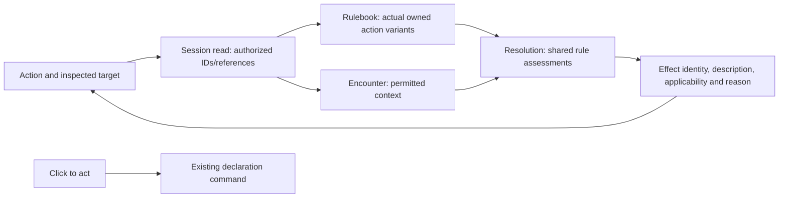

# Effect inspection — provider/read contract

Concrete R3–R5 proposal derived from the agreed behavior in
[design.md](design.md), especially R10 and R12–R15. **The host inspection read is
not implemented or handoff-ready as a whole.** C2's bounded encounter context is
published separately as encounter v0.111.0 via
[toolkit#1933](https://github.com/KirkDiggler/rpg-toolkit/pull/1933).
The [implementation handoffs](implementation-plan.md) carry the concrete build
contracts. Unsupported target facts are explicit Unknown inputs under R13, not a
requirement to build a new observation system before starting this wave.

## Shape



The inspection read supplies no permission to execute. The command still uses its
current declaration selector and authoritative execution path. No command waits
for a hover request, and neither an inspection error nor an unavailable calculation
changes the command's independent availability.

## 1. Consumer contract

Proposed session verb / RPC: `InspectActions`. One endpoint supports the two read
shapes needed by the consumer without overloading `Afford`:

```text
InspectActionsInput
  Session          required session ID
  Member           required actor ID; host binds to authenticated caller
  Action?          provider-authored ActionInformationRef
  Target?          inspected member ID; requires Action
  Option?          provider-authored cast option ID; requires a spell Action

InspectActionsOutput
  Actions[]        detached ActionInformation entries

ActionInformation
  Action           exact ActionInformationRef
  Name             canonical action name
  Description      canonical weapon/spell information, where supplied
  Context          actor-only or named inspected target; exact echoed option
  Effects[]        detached EffectInformation rows
  AssessmentIssues[]  scoped unavailable information, not command refusals
```

With no `Action`, return the current owned action-information list in deterministic
provider order, independent of turn, slot budget, spell-slot exhaustion or a frozen
window. It supplies the inspection references even when `Afford` returns generic
blockers. It is not a replacement full catalogue browser or a hypothetical build.

With `Action`, re-resolve that exact variant from the current actor and return one
entry. An optional target refines its applicability with permitted context. No
client-supplied positions, hostility booleans, condition state, ability modifiers,
rolls or calculations enter the request. No dummy character or mutating dry run.

Malformed combinations fail validation. A no-longer-owned/mismatched action ref
is stale inspection, not authority to use the old equipment. Unknown or
unpermitted targets return the same not-found shape; never expose a hidden member
through distinct errors. Missing target context on an otherwise valid read is not
an error: rules may return NeedsContext.

Exact protobuf numbering and SDK enum spellings belong in the checked transport
task after these semantic fields and their provider sources are closed.

## 2. Action identity is not a command selector

`ActionInformationRef` is a typed value, not a new stored object or a durable
opaque key. Proposed alternatives:

| Kind | Identity fields | Existing assembly it selects |
|---|---|---|
| Main-hand weapon/unarmed action | canonical content ref, equipment slot, actual equipped item ID (empty only for the provider's empty-hand unarmed form), grip, main-hand variant | `character.AssembleAttack` |
| Off-hand bonus weapon action | canonical content ref, off-hand slot/item, off-hand variant | `character.AssembleOffHandAttack` |
| Martial Arts bonus unarmed action | canonical unarmed ref, explicit Martial Arts bonus variant | `character.AssembleMartialArtsBonusAttack` |
| Known spell | canonical spell ref | `Character.CastDefinition`; optional option is a separate inspection input |

These are provider-produced current variants, not a UI menu inventing possible
grips or loadouts. Ref equality includes all relevant identity fields; equal
weapon names are not sufficient. Variant enumeration belongs in the rulebook
beside the assembly functions. Session must not duplicate equipment/class checks.

The measured off-hand and Martial Arts static eligibility functions already
exclude current capacity from their question: capacity is checked separately by
`session.compileOffersFor`. The new information enumerator reuses those static
rules and the existing precedence; it does not grant bonus attacks. Assembly with
no execution price is already supported, but the read must never present absent
price as a claim that the action is free.

Executable `Declaration` gains the matching informational reference as an optional
projection of its assembled action, not a second selector. The UI joins by that
provider value and sends the original declaration ID for a command. A metadata-
only answer cannot enable a button, and an unchanged declaration ID does not make
old effect information current.

The ownership/access boundary is unchanged: unchosen catalogue entries remain
catalogue information; this character-specific read does not pretend the actor
owns them. Known non-executable spell content can retain its description with
explicitly unavailable mechanics rather than fabricate a usable cast.

## 3. Effect rows, not a formula interpreter

Proposed detached row:

```text
EffectInformation
  Instance          evaluation-local row identity, not an offer/command token
  Source            canonical ref/name and permitted source identity
  Description       canonical explanation of what the effect is
  Assessment        Available | Unavailable
  Applicability?    Applies | DoesNotApply | NeedsContext (only when Available)
  Reason            rule-authored contextual explanation
  Needs[]           typed missing fact categories when applicability needs context
  Participation?    Contribution | Opportunity
  Selection?        selected/suppressed with provider-authored reason
  BenefitDetail     optional provider-authored current contribution/timing text
```

A loaded effect and an applicable effect are not synonymous. Conversely, a rule's
negative answer does not remove the row the player wants to inspect. The effect's
canonical description remains readable in the gray state. Unavailable assessment
has no invented negative applicability; known content can still be rendered.
Stacking suppression and optional participation are not ineligibility.

The row schema does not carry executable predicates, raw condition JSON, a live
rule object, offer tokens, target AC, success probability or predicted HP loss.
Underlying sourced terms support the shared evaluator; the client need not parse
or sum them to render an effect indicator or tooltip.

`conditions.DisplayFor` is an existing canonical name/detail foothold, not complete
tooltip coverage: many entries, including Sneak Attack, have no detail. Fill the
existing owner's content rather than introduce a second description table in
session/API/web. Feature and inherent-rule rows use their own content owners.

## 4. Provider boundaries and actual context sources

| Needed fact | Existing source | Required work / restriction |
|---|---|---|
| Actual actor/equipment/effect usage | Pure character load; current attack/cast assemblers | Root provides the inspectable variant enumerator and detached assessment snapshots. No bus attachment or target-sheet scan during the read. |
| Actor position and observed target/neighbors | Encounter `View` + strict `DecodeSightTestimony`; own placement | C2's `ObservedContext(*ViewInput)` consumes current testimony and emits detached members/pairs, measuring distances below session. No stale memory substituted for current placement. |
| Observed standing/equipment | `SightTestimony.Down`, `Equipment` with presence | Preserve unknown. “Observed standing” is not a general proof of every condition's absence or ability to react. |
| Relationship between actor and subject | `BelievedStance(viewer, subject)` | Already viewer-shaped, but must not be used to infer a relationship between two other subjects. |
| Observer-known target↔neighbor relationship | Existing believed-stance policy: absent deception, what is shown equals derived stance | C2 factors the same owner into `believedStanceBetween(observer,from,to)` and includes pairs only over the observer and current sighted members. Preserve the actual observer; do not infer from ring colors or query the target's viewpoint. No new stance policy. |
| Target-carried effects and their perceived facts | Current `Seen`/`SightTestimony` has no effect snapshot | Exact observation contract remains a gap. A full target sheet is not an acceptable substitute; an unknown fact stays unknown. |
| Whether target can see actor | Execution has directional sight capability | An execution answer about another creature's senses is not automatically information the actor knows. Its permitted observation source must be specified or the field remains Unknown. |
| Universe completeness | Current observer holdings enumerate known subjects | Complete holdings are not a guarantee that no unseen creature exists. Name the scope explicitly; no negative existential answer from an incomplete universe. |

The context provider returns factual evidence, never a `SneakAttackAllowed` value.
Resolution forms the operation frame; the rule answers applicability. Both read
and execution use the same rule decision function, with knowledge appropriate to
the consumer. No hidden-state-dependent provider inventory, source row or error
may escape the informational path.

## 5. Freshness, requests and existing frozen UI

- The web request key includes session, member, exact action reference, target and
  option. Each invalidation advances its request generation, including changes
  caused by another player. A late response for any prior key/generation is ignored.
- Keep the inspected target while its effect tooltip is being read. On a relevant
  event, mark its answer stale and fetch again; do not erase its content and do not
  label the retained applicability current. Same-reference new answers replace old.
- Moving hover from A to B may issue another read; debounce/coalescing is local
  implementation detail, not permission to reuse A's answer for B or defer a click.
- Existing frozen roll/offer views keep their frozen calculation. `InspectActions`
  describes current actor actions; it does not refresh an already-posed attack into
  a different calculation or mint a replacement offer. Do not join current effect
  rows into the existing `rollWindow` as if they were its historical contributors.
- No new persistent cache, event stream or per-session process is needed. Existing
  delivered events invalidate the read; session performs read/load/project only.

## 6. Planning readiness

Ready to specify without another product decision: separate informational read,
provider-authored action identity, effect row semantics, canonical descriptions,
request-generation handling and preservation of existing command/freeze behavior.
These follow R7–R15; the names above remain a concrete interface proposal.

C2 in the [implementation handoffs](implementation-plan.md) supplies the bounded
positions/distance/relationship provider in encounter v0.111.0 (toolkit#1933,
merge `f06cacf2`), with exact fields and passing provider tests; consumer adoption
and integration remain unverified.
It shares the existing public believed-stance policy; it does not create a second
relationship rule or claim observations describe every actual participant.

**Build treatment of unavailable facts:** C5 receives C2's actual pair facts and
leaves reverse sight/target effects Unknown. It never loads target sheets or
selectively binds hidden providers. This is R13's permitted conditional answer,
not proof that those target properties are absent. Known observed facts can still
establish positive applicability; incomplete observation cannot establish a
negative existential claim. C2 does not supply a complete target sheet.

C3–C9 in the [implementation handoffs](implementation-plan.md) name the matching
contracts, typed unknowns, tests and delivery sequence. The earlier blanket
“source gap blocks planning” wording was too broad: the agreement already answers
what unavailable facts mean. A genuinely new observed fact/lifecycle would still
need its own source and design, not a hidden-truth fallback.
