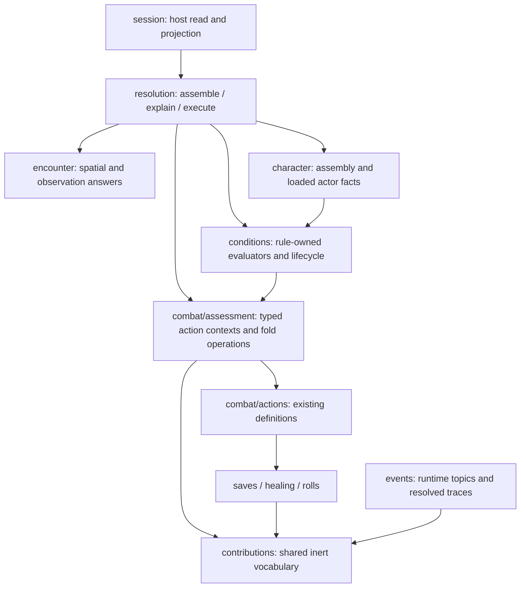

# Toolkit contract proposal

Concrete proposal for R3–R5. R1, R2 and R6–R10 are settled in
[design.md](design.md); the types below are design notation, not implemented APIs.
[contribution-sketch.md](contribution-sketch.md) contains the introductory example.
This document replaces its deliberately unspecified package placement with a
proposed dependency shape and names the remaining decisions rather than treating
them as implementation detail.

## 1. Package placement



Arrows here are proposed dependency direction, not chronological flow. Both new
packages are within the existing root `rulebooks/dnd5e` Go module, not new release
units. No dependency points from these packages back to resolution or session.

### `rulebooks/dnd5e/contributions` — the shared vocabulary

Own source identity, unresolved numeric terms, applicability/pending information
and the narrow generic roll-contribution capability. It does not import actions,
combat, conditions, character, events, resolution, encounter or session. Lower
vocabulary such as core refs and damage/ability identifiers is allowed.

Move the existing shared source and unresolved dice vocabulary out of
`events/roll_trace.go` into this package rather than create a competing identity.
Resolved traces remain with their current owner and reference the moved source
type. Migrate callers; do not retain two source models or permanent alias shims.
The existing attack/save dice-provider protocol can move with its value types;
extending attack assessment does not require a save to import an action profile.

### `rulebooks/dnd5e/combat/assessment` — action-specific contracts

Own the typed contexts, rule assessments and small pure fold operations for
weapon/spell action information. It may import `combat/actions`, `combat` and the
shared contribution vocabulary, but no content producer, persistence, event bus
or upper module. It does not enumerate Rage, Bless or spell identities.

Resolution orchestrates the fold using these tools. This package is not another
interaction runner and does not decide when to pay, roll, pause or resume.

### Existing owners stay owners

- `character` and `combat/weaponattack` assemble the action and preserve the
  evidence used to derive its numbers.
- `spells` owns authored spell descriptions and profiles; condition-specific
  descriptions stay with their content owner.
- `conditions` supplies its rule's pure assessment and retains lifecycle code.
- `resolution` loads participants, bounds the evaluation, assembles its answer
  and uses the same decisions during execution.
- `encounter` answers spatial and observer-context questions. Rule applicability
  is not moved into it.
- `session` loads records, carries context and projects detached answers. API and
  web never receive a rule evaluator or runtime character.

**Why two packages:** `combat/actions` already imports `saves`; `saves` imports
`rolls` and `events`. Putting the common contribution vocabulary inside actions
would make those lower consumers depend back on their consumer. Keeping the
small common terms below an action-specific assessment package prevents that
cycle without moving the whole action model or introducing another Go module.

## 2. Shared values, not a general-purpose rules language

The following names are proposed. Validation is part of each value contract.

| Value | Fields / meaning |
|---|---|
| `Source` | Existing `RollSource` identity: ref, name, optional role label, source entity ID |
| `Amount` | Exactly one of a signed fixed integer or an unsigned dice pool with add/subtract operator |
| `Term` | Stable calculation-local term ID, source and amount |
| `PoolID` | Identifies one particular damage pool; never a damage type used as identity |
| `Fact[T]` | Known value or Unknown; known zero/false/empty is distinct from Unknown |
| `Need` | A named input the owning rule cannot yet answer without; not an executable predicate |
| `Selection` | Selected or suppressed by the applicable stacking policy, retaining the responsible source |

The general values contain no spell registry, arbitrary callback, script, raw
condition JSON, world lookup, or player-facing authorization token.

A known fact cannot quietly become unknown on validation failure. An unknown fact
cannot retain a hidden meaningful value. Input validation rejects contradictory
or malformed states. Fact constructors and returned snapshots detach mutable
references; Go does not provide an effect system or deep immutability, so purity
also needs explicit tests.

## 3. Two independent questions about a rule

**Applicability** is one of:

- `Applies`: the rule's predicate is established for this scenario.
- `DoesNotApply`: the necessary facts establish that it does not apply.
- `NeedsContext`: the predicate cannot yet be decided from the supplied facts.

**Participation** describes how an applicable result participates:

- A current change to the action/calculation.
- A contribution in a named consequence branch, such as normal-hit damage.
- An opportunity at a future choice boundary.

Stacking selection is a separate decision. A second Bless can be applicable but
suppressed; that is not the same as absent, expired or inapplicable. Likewise,
Rage's damage contribution can apply to a normal-hit branch without a hit being
an established event. Do not encode all these axes in one `status` enum.

Known usage state can establish `DoesNotApply` without all other context: a spent
once-per-turn benefit need not pretend it is waiting for a target.

## 4. Rule binding and operation-specific assessment

Illustrative API shape in `combat/assessment`:

```go
// Design notation; not compilable declarations or a final wire schema.
type AssessAttackInput struct {
    Frame AttackFrame
}

type AssessAttackOutput struct {
    Decision AttackDecision
}

type AttackRule interface {
    AssessAttack(*AssessAttackInput) (*AssessAttackOutput, error)
}

type RuleBinding struct {
    Address     ConditionAddress
    Source      contributions.Source
    Boundary    Boundary
    Stage       Stage
    Ordinal     int
    Stack       StackPolicy
    Attack      AttackRule // Present only for this operation capability.
}
```

`ConditionAddress` means the existing source-qualified identity, not a new
identity schema. `Stage` refers to the rulebook's declared order; registration
ordinal preserves the applicable deterministic ordering, not map iteration.
The exact source-owner relocation must not introduce an imports-back-to-events
cycle in the shared package.

`AttackFrame` contains the current action profile, detached actor facts,
optional/unknown target facts, operation-relevant spatial facts, and already
established choices/results. It contains no mutable participant, roller, bus,
repository or arbitrary `context.Context` fact bag. Known facts from previous
fold steps are visible to later rules.

A binding is made from a loaded effect's snapshot. Its assessor calls a pure
rule-owned function; it does not execute the effect's live chain handler. The
receiver must not retain a writable link to a live participant or publish events.
These internal interfaces never cross the resolution output or session boundary.

Save and healing assessments have their own typed operation inputs. They share
terms and sources, not a giant structure of irrelevant fields. Bless's existing
attack/save dice decision remains one rule-owned implementation used from both
operations, not independently rewritten attack and save predicates.

### Decision shape

```text
AttackDecision = exactly one of

  Applies {
    changes: typed changes,
    opportunities: typed opportunities,
    explanation: rule-authored prose
  }

  DoesNotApply {
    reason: rule-authored explanation
  }

  NeedsContext {
    needs: typed fact needs,
    affected facets: which answers cannot yet be final,
    explanation: rule-authored prose
  }
```

An applicable result must contain meaningful changes or opportunities; empty
success cannot stand for unsupported evaluation. An inapplicable result applies
no edits. A pending result cannot silently supply settled arithmetic.

Public information about an unknown or suppressed rule is subject to the viewer's
knowledge boundary. Internal trace completeness is not permission to disclose an
unobserved effect, its source, or the fact that it exists.

## 5. Typed changes and opportunities

This is the first concrete vocabulary to test against current content, not an
open-ended `kind + JSON` protocol:

| Change / result | Carries | Current motivating rule |
|---|---|---|
| Add roll term | Source + fixed/dice term to a named roll | Archery; Bless/Bane |
| Add damage term | Source + amount + exact pool/type + critical treatment | Rage, Dueling, Divine Favor |
| Set attack ability | The chosen ability and its sourced modifier evidence | Martial Arts / Shillelagh assembly |
| Replace pool dice | Exact pool ID + replacement dice + source | Martial Arts / Shillelagh |
| Mark pool property | Exact pool ID + canonical property | Shillelagh magical weapon |
| Grant/impose keep rule | Source + advantage/disadvantage role | Reckless Attack, Help, Mockery |
| Set critical threshold | Threshold + source | Improved Critical |
| Damage reroll instruction | A typed, supported reroll rule + affected pools | Great Weapon Fighting |
| Critical-only contribution | A contribution in the critical-hit branch | Brutal Critical |
| Choice opportunity | Source + timing + benefit + consumption timing | Bardic Inspiration |

No change addresses a damage component by its type alone. Two slashing pools
remain two pools. Replacement retains an audit of the displaced term and its
source; it does not add both old and new dice or modifiers to the result.

No type here authorizes a choice or consumes a condition. Concrete offers and
frozen asks keep their current execution-owned types and lifecycle. New content
using an existing change shape needs no new resolution/content-identity switch;
a genuinely new operation shape does require a checked extension of the vocabulary.

## 6. Resolution entry and returned data

Proposed read entry: `resolution.ExplainAction`.

Its explicit input names:

- The actor and assembled action/assembly evidence.
- The declared participant universe, supplied as records.
- Whether the question is actor-only or target-specific and any selected inputs.
- The permitted encounter context and named consequence scenarios being described.

It does not accept an execution machine or a roller. It does not call `Resolve`
with a dry-run flag. Existing `ProjectCharacter` establishes that resolution may
own a derived read, but its current bus/AC path is not itself the new explainer.

```text
ExplainActionOutput
  Action identity and content information
  Assessments: sourced decisions and stacking selections
  Calculations:
    attack roll, normal-hit damage, healing, or other applicable typed result
    each with terms, declared roll policies, completeness and assumptions
  Opportunities: informational, not selectable offer tokens
  Pending: typed needs, scoped to the affected result
```

The read returns no updated world, dirty sheets, event list or persistence
command. It never creates a window or refreshes an effect. It has no authority to
execute the displayed action.

An explanation can be complete for **actor-side normal-hit damage before target
defenses** while target-specific advantage remains unresolved. Completeness and
assumptions belong on the relevant result, not one misleading global boolean.
A formula affected by an unresolved replacement is not displayed as a settled
formula. Known contributions can still be shown as contributions, with their
scope made explicit.

Session owns its public mirror, preserving these semantics without exporting
inner types. Whether it attaches the result to offers or supplies a separate
read remains a consumer-contract decision; no field is added solely to avoid
making that decision.

## 7. Composition algorithm and the ordering decision

For each operation boundary:

1. Validate the explicit universe, facts, scenario and rule-coverage declaration.
2. Assemble the base action and its original sourced terms once.
3. Obtain ordered rule bindings from the existing effect-loading path.
4. Ask a binding against the current read-only frame, not the initial frame
   reused for every rule.
5. Apply the owning stacking selection policy. Preserve suppressed source
   evidence; scope a group by its recipient/operation, not globally across actors.
6. Apply supported typed changes to the evaluation's own state. Replacement is a
   replacement, additive terms remain separate, and keep-rule cancellation keeps
   both granted and imposed source lists.
7. Propagate pending answers into the affected facets. A later rule cannot use a
   stale base value when a pending transformation could change it.
8. Return detached assessments and calculations. Render expressions from the
   terms in the toolkit; the client does not sum or infer them.

An unknown earlier provider in an oldest-applicable stacking group cannot simply
be skipped so a later provider becomes a certain winner. The selection remains
pending where that distinction can change the result.

### Explicit normalization (R9)

The current stage vocabulary is not itself a sufficient contract. Within each
stage, `events.StagedChain` runs modifiers in insertion order. Some current
modifiers roll first and then replace dice or ability information. The sketch's
promise to merely 'preserve the stages' did not settle those interactions.

**Settled direction, R9:** explicitly separate fact-changing assembly/normalization
from the contribution collection that depends on those facts, at the relevant
machine boundary. Resolution still owns sequencing; there is no dependency solver
or generic predicate language. A rule using a genuinely later outcome remains
at that later boundary rather than being moved before the roll.

This gives a stable meaning to 'the ability used by this action' before Rage tests
it and lets a replacement die be selected before it is rolled. It may change
incidental RNG consumption and expose existing ordering defects. Do not claim
all existing behavior is preserved just because nominal stage names match. Add
explicit paired-rule and roll-count regressions before migration.

The phase distinction matters: selecting a d8 instead of a d6 is normalization;
rerolling a face of 1 on that die is a post-roll operation. GWF belongs to the
second case, not to a blanket rule that all replacements happen before rolling.

## 8. Worked cases

### A. Bless + Rage: different calculations

Input: proficient greataxe attack, STR +3, PB +2, Rage +2, one Bless.

- Assembly: attack evidence STR +3 / PB +2; normal damage greataxe 1d12 slashing
  / STR +3.
- Bless: selected +1d4 to attack; does not alter damage.
- Rage: selected +2 to eligible normal-hit weapon damage; does not alter the
  attack roll.
- Actor-side answer: attack `1d20 + 5 + 1d4`; damage on a normal hit before
  defenses `1d12 + 5 slashing`, with all source terms retained.
- A ranged Dexterity action makes Rage inapplicable but leaves Bless applicable.
- A second equal-potency Bless is recorded as suppressed, not an extra d4.

Attack assembly must emit evidence while deriving the bonus. It must not recover
proficiency by subtracting an ability modifier from the current opaque
`AttackProfile.AttackBonus` scalar.

### B. Replacement before eligibility

Input: a held quarterstaff receives Shillelagh; the selected casting ability
beats Strength. The action's ability is the selected casting ability, its marked
weapon pool is 1d8, and that pool is magical.

- The replacement trace records the original pool and the selected replacement,
  with Shillelagh as source. It is not `1d6 + 1d8`.
- Rage may remain an active effect, but does not add a melee-Strength damage bonus
  to an action whose effective ability is not Strength.
- Martial Arts is the second case: its die/ability changes must feed both
  explanation and execution through the same normalization decision, without
  rolling discarded base dice during an informational read.
- Spellcasting ability is supplied, never assumed to be Wisdom. The example does
  not claim a character can cast Shillelagh while raging or that multiclass
  acquisition already exists; it tests the composition of supplied effect state.

### C. Target-dependent / once-per-turn

Input: an unspent Sneak Attack effect with a supported weapon action; target
facts are unavailable.

- Answer: pending eligibility for the target-dependent contribution; no guaranteed
  extra dice in the settled damage expression.
- If usage is already spent: inapplicable without needing the target.
- With sufficient permitted target facts: evaluate the same predicate and return
  applicable or inapplicable. Missing room/cast context must not mean 'no ally'.
- Current execution uses DEX as a weapon-eligibility proxy and a bool that maps
  absent context to false. These are measured limitations, not the new contract.
  Extraction must distinguish incomplete input from a definite negative.
  A change to the actual finesse/ranged gameplay rule needs an explicit ruling.

### D. Inspiration: opportunity, ask, continuation

- Advance read: 'Bardic Inspiration, d6, available after your attack roll'; not
  included in the attack expression and not an executable offer token.
- Execution reaches the existing post-roll boundary: freeze roll, calculation,
  offer identity and source. Ask spend/keep without disclosing target AC or
  unpublished success.
- Read at that pause: explain the frozen values, not fresh actor-sheet arithmetic.
- Spend: roll only the offered die, append its source term, consume exactly once,
  and resume. Keep: preserve the die and the frozen total.
- Neither branch rerolls Bless or the d20 or changes already-settled facts.
- The existing pose rejects more than one offer. Several advance opportunities
  must not imply that multiple simultaneous actionable offers are implemented.
  Future sequencing must freeze its choices explicitly, not pick an arbitrary
  first source.

### E. Save and healing spells are not attacks

Level-1 cleric with WIS +3, PB +2 and Life Domain:

- Sacred Flame: authored DEX-save consequence and damage; current caster DC 13.
  Bless on the caster does not increase that DC. A target's save modifiers are a
  different participant's calculation and not automatically public.
- Cure Wounds: existing healing declaration is `1d8` plus WIS +3 and Disciple of
  Life +3. Explain `1d8 + 6` as potential healing, not guaranteed restored HP;
  target exclusions and missing HP still matter.
- Spell-attack profiles reuse attack-roll assessment where appropriate. Damage
  and healing keep their typed consequences rather than masquerading as one
  damage number.

### F. Non-numeric content remains content

Bless's target count, range and concentration come from its cast profile/content;
its +d4 contribution comes from the applied effect. The description of choosing
Bless is not obtained by pretending that effect is already on the creator.

Content owns the prose explaining consequences and duration/restrictions that
are not yet uniformly projected. Resolution may ask a content-owned projector;
it never decodes unknown condition JSON to reverse-engineer descriptions.

### G. Great Weapon Fighting: a roll policy, then a trace

GWF is not a flat bonus and not a question to pose. Before rolling, the assessment
can describe its automatic policy on the qualifying weapon pool:

```text
Weapon damage: 2d6 + 3 slashing
Great Weapon Fighting: reroll each 1 or 2 once; keep its replacement.
```

The notation does not turn into an invented expected-damage bonus. The policy is
attached to the exact marked weapon pool; it does not apply to every pool with
the same damage type or every extra die contributed by a spell/feature.

After a real roll, the existing trace can show:

```text
Original weapon dice: [1, 4]
GWF reroll: die 0, 1 → 5
Final weapon dice: [5, 4]
```

The current implementation already preserves original faces, appends sourced
ordered rerolls, and stages updates so a failed reroll leaves the caller's trace
unchanged. It evaluates the current face after earlier reroll rules, rather than
restarting from the original face. Tests pin all of those properties. The new
work is a shared rule-owned policy available before rolling, not a second reroll
history or a client that infers the rule from a previous result.

Only execution applies the policy to faces and requests new dice. Reading its
description requests none. A successful replacement of 1 with another 1 does not
loop within the same GWF application.

Source: `conditions/fighting_style_great_weapon_fighting.go:136` and its suite.
The source handler's eligibility currently checks actor and marked primary pool;
a complete weapon/grip eligibility audit remains necessary before publishing
stronger applicability claims. That audit must not silently change gameplay rules
as part of authoring the description.

## 9. Migration boundaries and proof

| Owner | Required work | Proof that matters |
|---|---|---|
| root dnd5e: shared values | Move/reuse source and unresolved-term vocabulary; add action-assessment contracts | Dependency graph stays acyclic; values validate; known zero differs from unknown |
| root dnd5e: assembly | Preserve sources and exact pool identity at derivation | No reverse-engineering bonuses; grip/off-hand/multi-pool cases |
| root dnd5e: effects | Extract pure rule-owned assessments from current handlers | Same decisions used by explanation and execution; no copied eligibility tables |
| resolution | Compose assessments and consume them at machine boundaries | Ordering, stacking, visibility, zero RNG/write on reads, exact frozen continuation |
| session | Carry records/context and project results | No bus/rule arithmetic or inner runtime type on public surface |
| protos/API/web | Describe and carry the agreed result; render its sourced data | Presence and sources survive; normal character creation and in-play browser proof |

Add coverage declarations to the existing condition registration/loading path;
do not create a second ref-to-tooltip registry. Every loaded rule must be
explicitly classified as relevant to supported action-information operations,
not relevant, or unsupported by the new evaluator. An optional interface check
that quietly skips a chain-only rule cannot prove completeness.

**Recommended unsupported behavior, still a decision:** return an explicit
information error/status rather than an apparently complete partial answer.
Information failure does not itself change the action's independently established
legality. Release acceptance requires coverage for all currently offered content;
the runtime error path is a regression guard, not permission to omit hard rules.

Historical execution paths that remain live must either consume the extracted
rule decision or be retired as part of the owning migration. Leaving one handler
with the old predicate while the explainer has another defeats the component.

## 10. Measured evidence and remaining gates

Inspection uses toolkit `b784cf79`. The production import scan establishes:

```text
combat/actions → combat, saves, healing
saves → combat, events, rolls
rolls → events
events → abilities, damage, skills
```

This is why shared terms cannot depend on `combat/actions`. It also means the
moved source vocabulary must be below events, not an import back into it.

Focused existing tests passed on 2026-10-02 with `GOWORK=off GOPROXY=off` and
`-mod=readonly`:

```sh
# cwd: rpg-toolkit/.worktrees/choice-info-scout/rulebooks/dnd5e
go test -mod=readonly ./conditions ./rolls ./healing \
  -run 'Test(BlessedSuite|BanedConditionDescribesUnresolvedAttackAndSavePenalty|DescribeSelectedRollContributionsKeepsOldestPerConditionGroup|RagingConditionTestSuite|InspiredConditionTestSuite|MartialArtsTestSuite|ShillelaghClockSurvivesReloadAndIgnoresOtherTurns|Resolve|Validate|Healing)' \
  -count=1

# cwd: rpg-toolkit/.worktrees/choice-info-scout/rulebooks/dnd5e/resolution
go test -mod=readonly . \
  -run 'Test(BaneCalculationIsFrozenAcrossInspirationAnswers|BaneAttackUsesOneSelectedContributionAndRecordsCalculation|ATamperedFrozenBlobIsRefused)$' \
  -count=1
```

Each independent module uses its own pinned providers: the root module uses
core v0.11.0/events v0.6.2; resolution uses dnd5e v0.196.0, encounter v0.103.1,
core v0.12.0/events v0.6.3. These runs are baseline checks, not a test of locally
combined modules or the proposed component. No new
contract is compiled, no implementation is merged, and API/browser acceptance is
unrun.

Additional baseline check after the GWF discussion, using the same root module
and offline/read-only dependency flags:

```sh
go test -mod=readonly ./conditions \
  -run '^TestFightingStyleGreatWeaponFightingSuite$' -count=1
```

Result: PASS. The suite includes current-face ordering, immutable original faces,
source attribution, primary-pool selection and failure atomicity.

Before implementation:

1. R9 settles explicit normalization; specify the concrete phase boundaries and
   paired-rule/roll-count regressions for its migration.
2. Settle R4's member-visible context construction; never read hidden truth then
   hide only its source label. Current observations do not automatically expose
   every target condition needed for a complete evaluator.
3. Settle coverage/error semantics and the public delivery shape in R5; §11
   separates information lifetime from permission lifetime.
4. Derive exact module-isolated handoffs and tests from this contract. This is a
   measured design proposal, not a claim of an implementation-ready plan.

## 11. Initial information: read scope, delivery and freshness

R10 settles independent inspection, including alternatives after selection.
The remaining R4/R5 details below are proposals, not yet a ruled endpoint shape.
The user-facing addition is the information available before committing an action.
Existing combat-log reroll presentation is not a new feature in this effort;
execution and its trace are the reference the initial explanation must match.

### An explanation is not an executable offer

An action remains describable when a character cannot currently execute it. Do
not make `resolution.ExplainAction` accept or require a current declaration
selector. It consumes a provider-assembled action and permitted facts, not proof
that the actor has an action left or owns the current turn.

An executable offer may carry that explanation, but it is only one consumer.
The same read must fit character inspection and future target refinement without
minting an attack, bypassing a frozen window, or reinterpreting a display key as
an execution selector.

This is a concrete constraint of the current API: `session.Afford` returns
identity-less generic blockers off-turn, social rows on the world clock, and
window-related rows while frozen (`session/afford.go:542–620`). Attaching rich
information solely to compiled offers would make specific weapon/spell details
disappear at those boundaries. Do not widen turn legality or synthesize fake
executable rows to keep information visible.

**Settled direction, R10:** separate information access from execution eligibility.
The player can inspect permitted catalogue entries they did not choose, including
after finalizing a selection. A catalogue ref must not require proof that the
character owns that weapon or knows that spell. Reading never grants or equips it.

The character-specific read is a different question: resolve the authorized
character's actual equipment/action variant and current effects, while the
existing declaration selector continues to authorize the actual command. A ref
alone does not identify an equipment instance or grip; use the provider's
owned-item/slot and action-variant semantics, not a name match. Exact request
fields remain a contract task, not an arbitrary new identifier scheme.

Looking up an unchosen spell does not fabricate a character who knows it or
quietly simulate rebuilding the character. It returns the catalogue explanation.
Hypothetical build/equipment comparisons would require an explicitly named
scenario contract; they are not implied by post-selection inspection.

### Three kinds of inputs, not one omniscient preview

| Read | Inputs allowed | What it can honestly say |
|---|---|---|
| Catalog inspection, during or after choices | Permitted canonical authored content, whether selected or not | Effect, base mechanics, costs/range/restrictions; no fabricated character DC or modifiers |
| Current actor action | Authorized actor facts, current actor-carried effects and provider-assembled action | Current actor-side terms, applicable automatic policies, own opportunities, explicit context needs |
| Refined context | The same action plus explicitly permitted target/spatial facts and a declared universe | Refine only the decisions that those facts can settle |

The current-actor read is not a promise to know everything surrounding the actor.
An effect whose applicability depends on nearby participants remains pending if
that context is unavailable. Future aura/target support supplies that context to
the existing evaluator; it is not permission to silently skip other participants
and claim a complete interaction prediction.

The toolkit must not substitute a hidden true value for an unavailable observed
fact. Nor can it enumerate unseen opponent effects and then merely hide their
source labels: a changed formula, a new pending row or a different error can leak
the same secret. Sources carried by the actor's own effect record retain their
existing disclosure policy; a display label does not justify looking up an
otherwise unseen caster.

**Recommended R4 boundary:** actor-side information does not inspect unpermitted
opponent state. A target-specific result consumes a bounded observation/fact
projection, rather than full opponent sheets exposed to informational evaluators.
Execution remains a separate authoritative evaluation with its required complete
participant universe. Context construction is owned below session by encounter
and rulebook projections; session does not decide which rules a hidden fact would
have changed.

At initial presentation, target-dependent statements are conditional because the
question lacks that context, not because a hidden-world probe discovered a secret.
No target-aware UI is required merely to establish this contract.

### Information content and rendering

The public projection needs these distinct parts:

- Authored description and restrictions from the content owner.
- Typed calculations with provider-formatted expressions and their sourced terms.
- Automatic policies, such as GWF, attached to the calculation/pool they affect.
- Opportunities, such as Inspiration, with timing and source but no offer token.
- Pending context and explicit scope/assumptions for each affected result.

Cost, target shape and availability already carried on a concrete declaration
remain authoritative there; the information projector must not invent another
price or independently derive whether the button is enabled. Catalog cost means
base authored cost, not a claim that every cast by every actor pays that price.

The UI chooses layout and expansion, not mechanical applicability. It need not
parse formulas to extract dice, invent prose from condition refs, infer policy
from a previous combat log, or fetch whole low-level effect blobs.

Creation spell details should be supplied for the exact choices/grants the
provider returns, using one canonical content projector. Do not make coverage
depend on the UI guessing spell levels `[0, 1]`. Inline enrichment and a
ref-complete catalog read are the transport alternatives; neither changes the
choice refs that authorize selection. The exact transport remains open.

### An action selector is not an information revision

`session/declaration_id.go` hashes the compiled definition for attacks/casts.
It does not hash all execution-time effects. A Bless/Rage change can therefore
change the explanation without changing that ID. The component must not cache
current information indefinitely by declaration ID or by the content ref alone.

Build a concrete offer and any attached explanation from the same loaded
actor/action inputs. This is per-request consistency, not a claim that the current
repositories provide an atomic snapshot of the entire world. A separate
information read has its own freshness; it cannot make an older command offer
fresh or overwrite a newer actor's data.

Web already retains last-good declarations separately from `fresh` and discards
superseded response generations (`src/api/useSessionAfford.ts`). Every delivered
session event invalidates authority and schedules Turn/Afford refresh
(`src/components/session/SessionEncounterView.tsx:1131`). The information path
must follow the relevant state invalidation—including effects caused by another
player—not start a second permanent ref-only cache. Same-ID responses still
replace their informational values. Stale information may be retained as visibly
stale data, never described as current or used as authority.

A frozen question is the exception in the opposite direction: its calculation is
read from the frozen record, not refreshed into a different calculation from the
current actor. R8 remains the lifecycle boundary.

### Required distinguishing checks

- Off-turn/no-resource/frozen states do not require minting an executable offer
  merely to describe an owned action. Existing command refusals remain intact.
- Bless begins/ends while a declaration ID stays the same: the information
  changes on a successful current read; an older response cannot restore it.
- Alter only hidden opponent state while permitted inputs remain identical:
  informational output, including sources/pending/error shape, stays identical.
- An unknown spatial fact and a known negative fact produce different internal
  assessments; missing context is not treated as a failed predicate.
- All returned creation choice/grant refs have truthful content information;
  no name-only fallback silently passes the completeness check.
- After selecting one option, other permitted catalogue alternatives remain
  readable without modifying the saved choice, inventory or spell access.
- A catalogue inspection carries no fake current-character bonuses or executable
  selector. Existing affordability messages and command refusals remain unchanged.
- An unsupported informational rule yields an explicit information failure, not
  a complete-looking partial formula or a new permission to execute.

Additional current-behavior baseline, session module, offline and read-only pins:

```sh
GOWORK=off GOPROXY=off go test -mod=readonly . \
  -run 'TestAffordSuite|TestDeclarationIDChangedProfileChangesID|TestDeclarationIDSameStateRecurrence' \
  -count=1
```

Result: PASS, using session's pinned dnd5e v0.197.0, encounter v0.109.0 and
resolution v0.59.0. This checks the existing offer/selector behavior; the proposed
independent information read and visibility guarantees are not implemented or
runtime-verified.
